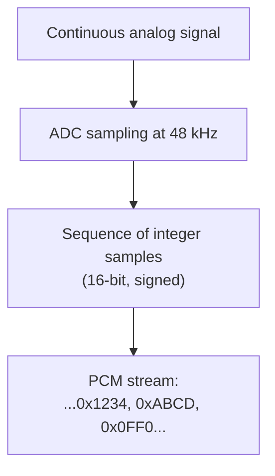

# Audio Driver (Pro)

The Audio driver lets Serial Studio treat any OS-level audio input device as a high-rate analog data source. Microphones, line-in, audio interfaces, USB DACs, virtual loopback devices: anything the OS can record from. The driver became the proof-of-concept for Serial Studio's high-throughput hot path. If the FrameBuilder can keep up with 48 kHz multi-channel audio, it can keep up with almost anything else.

If you don't need acoustic analysis specifically, you can still use the audio driver as a quick way to feed analog signals into Serial Studio (vibration sensor on a microphone preamp, current shunt through an audio interface, etc.).

## What is digital audio?

Digital audio is the **discrete-time, discrete-amplitude** representation of an analog sound waveform. Three numbers describe it:

- **Sample rate.** How many times per second the analog waveform is measured. Typical values: 44100, 48000, 96000, 192000 Hz.
- **Bit depth.** How many bits each sample uses. Typical values: 16-bit signed integer, 24-bit signed integer, 32-bit float.
- **Channels.** How many independent waveforms are bundled together. 1 = mono, 2 = stereo, more for surround formats.

The encoding scheme almost always used is **PCM** (Pulse-Code Modulation): each sample is just the amplitude at that instant, encoded as an integer or float. No compression, no transformations, no headers per sample.

### Sample rate and the Nyquist limit

The Nyquist–Shannon sampling theorem says: to faithfully reconstruct a signal containing frequencies up to **f**, you must sample at a rate of at least **2f**. So a 44.1 kHz sample rate can capture frequencies up to ~22.05 kHz, which exceeds the upper limit of human hearing (~20 kHz). That's why CD audio settled on 44.1 kHz in the early 1980s.

Higher sample rates (96, 192 kHz) are common in studio work, mostly for headroom during processing rather than for capturing sound above 22 kHz. For Serial Studio's purposes:

- **44.1 / 48 kHz** is plenty for general acoustic capture, vibration analysis up to ~20 kHz, audio fingerprinting.
- **96 / 192 kHz** gives you ultrasonic headroom. Useful for some non-destructive testing, bat detectors, ultrasound transducers.
- **Below 44.1 kHz** is rare on PC audio hardware. Some interfaces support 22, 16, or 8 kHz for legacy compatibility.

If you sample below 2× the highest signal frequency, you get **aliasing**: high frequencies fold back into the audible band as ghost signals at the wrong pitch. Most audio hardware filters out high frequencies before sampling to prevent this; if you're feeding Serial Studio raw signals from custom hardware, make sure your input is bandwidth-limited.

### Bit depth and dynamic range

Each PCM sample's bit depth determines the smallest amplitude difference that can be represented. The signal-to-noise ratio (SNR) of a perfectly-quantized sine wave is roughly **6 dB per bit**:

| Bit depth | Theoretical SNR | Use case |
|-----------|-----------------|----------|
| 8-bit     | ~48 dB          | Voice memos, low-quality streaming |
| 16-bit    | ~96 dB          | CD-quality, most consumer audio |
| 24-bit    | ~144 dB         | Studio recording, master tapes |
| 32-bit float | effectively unlimited | Mixing, processing |

Anything below the bit depth's noise floor is lost. For Serial Studio applications, 16-bit is usually fine; 24 or 32-bit float gives you headroom for signals that vary across many orders of magnitude.

### Channels

A stereo signal is two PCM streams interleaved sample-by-sample: `L, R, L, R, L, R, ...`. A 4-channel interface gives `1, 2, 3, 4, 1, 2, 3, 4, ...`. The OS exposes each channel as a separate stream of samples, all sharing the same sample rate and bit depth.

For Serial Studio, each input channel can drive its own dataset. A 4-input audio interface with sensors on each input gives you 4 independent telemetry streams.

## How Serial Studio uses it

The audio driver is built on **miniaudio**, a single-header cross-platform audio library. miniaudio talks directly to:

- **WASAPI / WaveOut** on Windows
- **Core Audio** on macOS
- **ALSA / PulseAudio / JACK** on Linux

This avoids the overhead of QtMultimedia and gives the driver direct access to low-latency callback-based capture.

### Threading and timestamps

The audio driver is the most thread-heavy of all Serial Studio drivers:

- The **audio backend** (miniaudio internal threads) calls a capture callback on its own thread whenever a buffer of samples is ready.
- The audio driver runs a **dedicated worker thread** with a 10 ms `Qt::PreciseTimer` at high priority, which polls the captured-buffer queue and forwards data downstream.
- When a buffer of N samples arrives, the driver **back-dates the timestamp** to `now - (N-1) / sample_rate` so the first sample carries the correct acquisition time, not the time the OS got around to firing the callback.

This timestamp accuracy is what makes audio data line up correctly in CSV exports and session reports even when the audio backend buffer is large. See [Threading and Timing Guarantees](Threading-and-Timing.md) for the full timestamp ownership rules.

### What you get downstream

For each captured buffer, Serial Studio emits one frame per sample (or per channel, depending on configuration). The frame parser sees the raw PCM values; you can:

- Plot them directly as time-domain waveforms.
- Drive an FFT widget for spectrum analysis (the audio driver added the FFT pipeline that other drivers now reuse).
- Drive a Waterfall (spectrogram) widget for time-frequency analysis.
- Apply per-dataset transforms for filtering, scaling, or unit conversion.

The FFT and Waterfall widgets share the same per-dataset settings (`fftSamples`, `fftSamplingRate`, `fftMin`, `fftMax`), so a single audio channel can drive both views simultaneously.

### Configuration

| Setting | Controls |
|---------|----------|
| **Input device** | Which OS audio device to capture from |
| **Sample rate** | Sample rate, in Hz. Available rates depend on the hardware. |
| **Sample format** | Bit depth and integer/float encoding. |
| **Channel configuration** | Mono or stereo, depending on the device. |

For step-by-step setup, see the [Protocol Setup Guides → Audio Input section](Protocol-Setup-Guides.md).

## Common pitfalls

- **No audio detected.** Verify the input device in your OS audio settings first. On macOS, grant Serial Studio Microphone permission in **System Settings → Privacy & Security → Microphone**. On Linux, check `arecord -l` (ALSA) or PulseAudio's `pavucontrol` to confirm the device exists and isn't muted.
- **Distorted signal at high amplitude.** You're clipping the input. Reduce the input gain at the OS level (or on the hardware preamp). PCM saturation produces hard distortion that looks like sharp peaks at the bit-depth max.
- **High noise floor.** Microphone inputs have higher noise than line inputs. If you're driving a low-impedance signal source into a microphone input expecting a millivolt-range mic signal, the preamp will amplify the noise too. Use a line input where possible.
- **Wanted sample rate not available.** The hardware reports its supported sample rates and Serial Studio only offers those. If you need a rate the hardware doesn't support, the audio driver can't fake it. Use a different audio interface.
- **FFT or waterfall looks wrong.** Set `fftSamplingRate` on the dataset to match the audio sample rate. If sample rate is 48 kHz but `fftSamplingRate` is 1000, the frequency axis will be scaled by 48×.
- **Latency feels high.** Audio backends typically buffer 10–50 ms by default. For real-time visualization that's fine; for closed-loop applications it isn't. Lower-latency capture requires backend-specific tuning that Serial Studio doesn't currently expose.
- **Stereo input but you only see one channel.** Channel configuration is set to Mono. Switch to Stereo and the second channel will show up as a second dataset.
- **The driver pegs CPU at 192 kHz.** It shouldn't, but FFT plus waterfall plus high sample rate is genuinely a lot of work. Reduce `fftSamples` or disable the waterfall on per-dataset settings.

## References

- [Audio bit depth — Wikipedia](https://en.wikipedia.org/wiki/Audio_bit_depth)
- [Digital audio basics: audio sample rate and bit depth — iZotope](https://www.izotope.com/en/learn/digital-audio-basics-sample-rate-and-bit-depth)
- [44,100 Hz — Wikipedia](https://en.wikipedia.org/wiki/44,100_Hz)
- [Understanding Sample Rate, Bit Depth, and Bit Rate — Headphonesty](https://www.headphonesty.com/2019/07/sample-rate-bit-depth-bit-rate/)
- [miniaudio — single-file audio playback and capture library](https://miniaud.io/)

## See also

- [Protocol Setup Guides](Protocol-Setup-Guides.md): step-by-step Audio Input setup.
- [Data Sources](Data-Sources.md): driver capability summary across all transports.
- [Communication Protocols](Communication-Protocols.md): overview of all supported transports.
- [Widget Reference](Widget-Reference.md): FFT Plot and Waterfall widget configuration.
- [Dataset Value Transforms](Dataset-Transforms.md): per-channel calibration, scaling, and filtering of audio samples.
- [Threading and Timing Guarantees](Threading-and-Timing.md): for why audio's timestamp handling matters.
- [Use Cases](Use-Cases.md): examples of acoustic analysis with Serial Studio.
