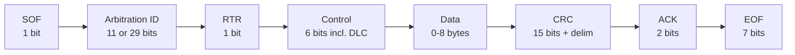
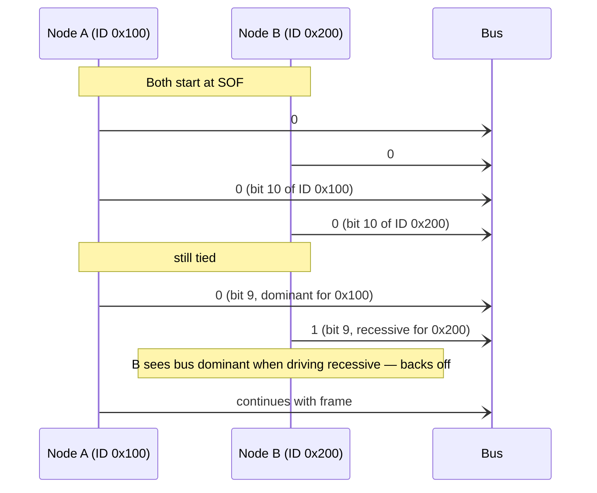

# CAN Bus Driver (Pro)

CAN Bus is the nervous system of nearly every modern vehicle and a huge fraction of industrial automation. If you're working with an ECU, an electric motor controller, an automotive diagnostic tool, or any kind of distributed embedded system bigger than one PCB, you'll meet CAN sooner or later.

Serial Studio Pro implements CAN Bus through Qt's `QtSerialBus` module, which fronts SocketCAN (Linux), PCAN (PEAK), Vector (Windows), Kvaser (cross-platform), and a handful of others. DBC files are imported automatically by the [Auto-Generating Projects](Auto-Generating-Projects.md) flow.

## What is CAN?

The Controller Area Network was developed by Bosch in 1986 for in-vehicle communication. It is a **multi-master, message-broadcast, differential-pair** bus standardized as ISO 11898. The design priorities show through the spec:

- **Robust against electrical noise.** Differential signaling on a twisted pair, twisted hard.
- **No central master.** Any node can transmit at any time.
- **Deterministic priority.** Higher-priority messages always preempt lower-priority ones.
- **Built-in error detection.** CRC on every frame, automatic retransmission, faulty nodes self-quarantine.

The cost of all that is a low data rate (1 Mbps for classic CAN, up to 8 Mbps for CAN FD) and small payloads (8 bytes per frame for classic CAN, 64 bytes for CAN FD).

### Frame structure

A simplified classic CAN data frame:



The two pieces that matter day-to-day:

- **Arbitration ID.** Identifies the message. 11 bits = "standard" (CAN 2.0A), 29 bits = "extended" (CAN 2.0B). Lower IDs win arbitration (have higher priority). The ID is **not an address** in the TCP/Modbus sense; nobody is being addressed. It identifies the meaning of the message, and any node that cares filters by ID.
- **Data.** 0–8 bytes for classic CAN, up to 64 for CAN FD. The bytes are vendor-defined: the meaning of byte 3 of message 0x7E8 is in the DBC file or the OEM's spec.

### Bitwise arbitration: how nobody collides

CAN is a multi-master bus where any node can transmit, and yet there are no collisions. The trick is **non-destructive bitwise arbitration**.

Two voltage states on the bus:

- **Dominant** (logic 0): driver pulls the bus to a defined level.
- **Recessive** (logic 1): driver releases the bus, biasing resistors hold it at the recessive level.

If two nodes start transmitting simultaneously and both reach a bit position where one drives dominant and the other drives recessive, the dominant always wins (it physically overrides the recessive). The node that was driving recessive sees that the bus has gone dominant when it shouldn't have, and immediately stops transmitting. The dominant node continues without knowing anything happened.



Because lower numerical IDs have more leading zeros (dominant bits), they always win arbitration. A safety-critical engine message at ID `0x010` will preempt an infotainment message at `0x500` every time. This is why ID assignment in a CAN network is a careful design exercise: priorities are baked into the IDs.

### Bit timing

CAN's reliability depends on every node sampling each bit at the right place. Bit timing is divided into **time quanta** allocated across four segments (sync, propagation, phase 1, phase 2). At a high level you don't need to know the details. You pick a **bit rate** (e.g. 500 kbps) and the controller computes the rest.

Common bit rates: 125 kbps, 250 kbps, 500 kbps, 1 Mbps. CAN FD adds a faster data-phase rate (up to 8 Mbps) used after the arbitration phase.

The bit rate must match across **all** nodes on the bus exactly. Even a 1% mismatch causes errors.

### CAN FD

CAN with **Flexible Data-rate**, introduced by Bosch in 2012. Two improvements:

- **Up to 64 bytes of payload** per frame (vs 8 for classic).
- **Higher data-phase bit rate** (up to 8 Mbps) after the arbitration phase, while keeping the arbitration phase at the slower bit rate to preserve priority semantics.

If your hardware and all your nodes support CAN FD, use it. The payload increase is the bigger deal in practice. Many automotive protocols (UDS, ISO-TP) get faster and simpler when each frame can carry more bytes.

### DBC: the signal database

Raw CAN gives you bytes in messages. **DBC** (CAN Database) files describe what those bytes mean. A DBC entry looks like:

```
BO_ 256 EngineData: 8 ECU
 SG_ EngineRPM : 0|16@1+ (0.25,0) [0|16383] "rpm" Dashboard
 SG_ ThrottlePosition : 16|8@1+ (0.392,0) [0|100] "%" Dashboard
 SG_ EngineTemp : 24|8@1+ (1,-40) [-40|215] "°C" Dashboard
```

That declares: message ID 256 (`0x100`), 8 bytes long, sent by `ECU`, received by `Dashboard`. It contains three signals:

- **EngineRPM** at bit 0, 16 bits wide, little-endian, unsigned, factor 0.25, offset 0, range 0-16383, units rpm.
- **ThrottlePosition** at bit 16, 8 bits wide, factor 0.392, offset 0, units %.
- **EngineTemp** at bit 24, 8 bits wide, factor 1, offset -40, units °C.

Most automotive and industrial CAN networks ship with a DBC describing every message and signal. Serial Studio's importer reads the file and generates a project automatically. See [Auto-Generating Projects](Auto-Generating-Projects.md).

## How Serial Studio uses it

The CAN driver wraps `QCanBusDevice`. Setup involves:

| Setting | Controls |
|---------|----------|
| **Plugin** | Which CAN backend to use: `socketcan` (Linux), `peakcan`, `vectorcan`, `systeccan`, `tinycan`, etc. |
| **Interface** | Which physical interface inside that backend (e.g. `can0`, `PCAN_USBBUS1`). |
| **Bit rate** | Must match the bus exactly. |
| **CAN FD enabled** | Whether to use the flexible-data-rate frame format. |
| **Data bit rate** (CAN FD) | The faster rate used in the data phase. |

For Linux SocketCAN, the interface needs to be brought up from a terminal **before** Serial Studio connects:

```sh
sudo ip link set can0 type can bitrate 500000
sudo ip link set up can0
```

For CAN FD:

```sh
sudo ip link set can0 type can bitrate 500000 dbitrate 2000000 fd on
sudo ip link set up can0
```

### Frame parsing

By default, Serial Studio receives every CAN frame as a structured object containing the ID, DLC, and data bytes, and feeds it through the frame parser. With a DBC-imported project, the auto-generated Lua parser dispatches by CAN ID and extracts each signal at the documented bit offset, applies factor and offset, and writes the value into the matching dataset.

If you build the project by hand, you write your own dispatch logic in Lua or JavaScript. See [Frame Parser Scripting](JavaScript-API.md).

### Threading

The CAN driver runs on the main thread; Qt's async I/O delivers received frames via signals. There's no dedicated worker thread for CAN. See [Threading and Timing Guarantees](Threading-and-Timing.md).

For step-by-step setup, see the [Protocol Setup Guides → CAN Bus section](Protocol-Setup-Guides.md).

## Common pitfalls

- **No frames received.** Bit-rate mismatch is the #1 cause. Even a 1% deviation rejects every frame. Verify with the bus owner or check the device documentation. Use a CAN analyzer (PCAN-View, candump, BusMaster) to confirm traffic exists at the bit rate you expect.
- **Error frames only.** Termination missing or wrong. CAN buses need exactly **two** 120 Ω terminators, one at each physical end of the trunk. Measure between CAN-H and CAN-L with the bus powered off; you should read about 60 Ω. Anything else is a wiring problem.
- **Interface not listed (Linux).** Run `ip link show can0`. If the interface isn't there, the kernel module isn't loaded. `modprobe can_dev` and `modprobe vcan` (for virtual CAN testing) usually fix it.
- **Permission denied on SocketCAN.** Your user needs the `dialout` or `can` group depending on distro. `sudo` works as a quick test but isn't a long-term answer.
- **DBC import generates wrong values.** Check byte order on the signals. DBC supports both little-endian (Intel) and big-endian (Motorola) encoding within the same message. Auto-generated parsers handle both, but if you've manually edited the DBC and the byte order is misdeclared, values will look scaled-and-shifted-wrong.
- **Multiplexed (MUX) signals don't decode.** The auto-generated parser doesn't handle DBC multiplexing. If a single message ID carries different payloads gated by a mux byte, edit the generated Lua to add the mux check, or write a custom parser.
- **CAN FD frames are dropped.** The bus, the adapter, and Serial Studio all need to be in CAN FD mode. Mixing classic-only nodes on a CAN FD bus works only if the FD nodes downshift, which not every adapter supports.
- **PCAN/Vector/Kvaser SDK not found (Windows).** The vendor driver and runtime have to be installed separately. Qt's CAN plugin is just a wrapper; the actual hardware support comes from the vendor.

## References

- [CAN bus — Wikipedia](https://en.wikipedia.org/wiki/CAN_bus)
- [CAN Bus Explained: A Simple Intro — CSS Electronics](https://www.csselectronics.com/pages/can-bus-simple-intro-tutorial)
- [CAN Bus Protocol Tutorial — Kvaser](https://kvaser.com/can-protocol-tutorial/)
- [CAN FD Protocol Tutorial — Kvaser](https://kvaser.com/can-fd-protocol-tutorial/)
- [An Introduction to CAN FD — Vector (PDF)](https://cdn.vector.com/cms/content/know-how/can/Slides/CAN_FD_Introduction_EN.pdf)

## See also

- [Auto-Generating Projects](Auto-Generating-Projects.md): DBC file import.
- [Protocol Setup Guides](Protocol-Setup-Guides.md): step-by-step CAN setup.
- [Data Sources](Data-Sources.md): driver capability summary across all transports.
- [Communication Protocols](Communication-Protocols.md): overview of all supported transports.
- [Use Cases](Use-Cases.md): automotive and industrial CAN dashboards.
- [Troubleshooting](Troubleshooting.md): bit-rate, termination, and adapter-detection diagnostics.
- [Drivers — Modbus](Drivers-Modbus.md): the other industrial protocol.
- [Frame Parser Scripting](JavaScript-API.md): for editing the generated parser by hand.
