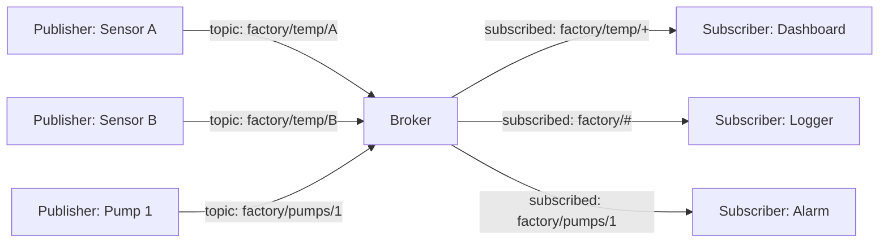
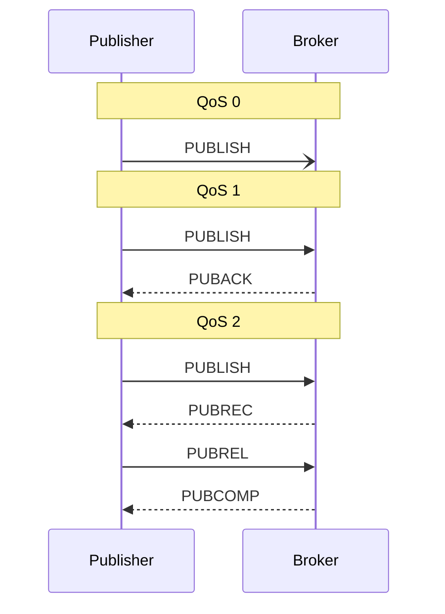

# MQTT Driver (Pro)

MQTT is the standard publish/subscribe protocol for IoT. It is the right transport when many devices share a network and the publishers and subscribers should not need to know about each other directly. The header is small, it is robust over unreliable links, every constrained microcontroller has a client, and bridging it into a dashboard is straightforward.

This page is the protocol primer. For step-by-step Serial Studio setup (broker connection, topics, QoS, TLS), see [MQTT Integration](MQTT-Integration.md).

## What is MQTT?

MQTT stands for **Message Queuing Telemetry Transport**. The name is partly historical — MQTT does not provide queuing in the traditional sense, but the publish/subscribe and "telemetry over unreliable links" parts of the name still describe it accurately. The protocol was designed in 1999 by IBM for monitoring oil pipelines over satellite links and standardised as an OASIS specification in 2014. The current version is MQTT 5.0 (2019); MQTT 3.1.1 remains extremely common in the field.

The core idea is decoupling. Publishers and subscribers do not connect to each other. They connect to a **broker**, and the broker handles routing.



A new publisher coming online does not announce itself to subscribers; it simply publishes to a topic, and any subscriber listening to that topic receives the message. A new subscriber does not announce itself to publishers; it subscribes to a topic pattern, and the broker routes new messages to it. Either side can be added or removed without coordination.

### Topics

Topics are hierarchical strings separated by `/`:

```
factory/floor1/zone3/temperature
home/livingroom/sensors/humidity
serial-studio/devices/esp32-001/data
```

The broker does not enforce a schema (topics are just strings), but conventions matter for subscribers. Common practice is to put the most general scope first and the most specific last.

Subscribers can use **wildcards**:

- `+` matches exactly one level. `factory/+/temperature` matches `factory/floor1/temperature` and `factory/floor2/temperature` but not `factory/floor1/zone3/temperature`.
- `#` matches all remaining levels. `factory/#` matches everything that starts with `factory/`. It must be the last character of the pattern.

### Quality of Service (QoS)

MQTT publishes can carry one of three QoS levels:

| QoS | Name             | Guarantees |
|-----|------------------|-----------|
| 0   | At most once     | Fire and forget. The message is sent, and it's gone. No retransmission, no ack. May be lost. |
| 1   | At least once    | The publisher resends until it gets a PUBACK from the broker. The subscriber may receive duplicates. |
| 2   | Exactly once     | Four-way handshake (PUBLISH → PUBREC → PUBREL → PUBCOMP). Guaranteed delivery, no duplicates. Slowest. |

For telemetry, QoS 0 is usually adequate: if a temperature reading is lost, the next one is already on its way. Choose QoS 1 when loss is unacceptable but duplicates are (the application deduplicates). QoS 2 is for "must arrive exactly once" cases such as billing events and is rarely worth its cost for streaming data.



### Retained messages

A publisher can mark a message as *retained*. The broker remembers the last retained message on each topic and delivers it immediately to any new subscriber. This is the way to signal "current state" rather than "events":

- `home/heating/setpoint` retained — the current setpoint, available to anyone who subscribes.
- `home/heating/events/setpoint-changed` non-retained — the change events, only seen by clients listening at the time.

Retained messages do not expire unless MQTT 5 message expiry is set. Publishing an empty payload to a topic with the retain flag clears the retained message.

### Last Will and Testament

When a client connects, it can register a **Last Will** message: a topic, payload, and QoS that the broker publishes if the client disconnects ungracefully. This is the standard way to detect dead clients. Each client publishes a retained "I'm here" message on connect and a Last Will of "I'm gone" on the same topic; subscribers always know which clients are alive.

### Sessions and clean session

By default MQTT 3.x assumes persistent sessions: the broker remembers a client's subscriptions and queued messages across disconnects, keyed by the client ID. When the client reconnects, it resumes where it left off.

For interactive clients — a dashboard connecting from a laptop — persistent sessions usually cause more confusion than they solve. **Clean session = on** is the right default for most Serial Studio uses; the broker forgets the client between connections.

## How Serial Studio uses it

The MQTT driver wraps Qt MQTT (`QMqttClient`) and can run in two complementary modes:

- **Subscriber mode.** Serial Studio connects to the broker, subscribes to a topic, and treats every received payload as a frame. Use this to ingest telemetry from a fleet of devices into a dashboard.
- **Publisher mode.** Serial Studio reads from another driver (UART, network, BLE, ...) and republishes each parsed frame to an MQTT topic. Use this to bridge a serial device into existing IoT infrastructure.

Both modes can run in parallel: subscribe to one topic and publish to another. The MQTT client runs on Qt's event loop on the main thread, like every other driver that does not need a worker thread.

For step-by-step setup (broker URL, topics, TLS, authentication, MQTT 5 features), see [MQTT Integration](MQTT-Integration.md).

## Common pitfalls

- **Connection refused / authentication failed.** Verify the broker hostname, port, username, and password with another tool first (Mosquitto's `mosquitto_sub` or the MQTT Explorer GUI). Eliminate the broker as a variable before debugging Serial Studio.
- **Subscribed but no data.** Check the topic spelling. Topics are case-sensitive: `Factory/Temp` is not the same as `factory/temp`. The publisher may also be using a different level structure than expected. Running `mosquitto_sub -t '#' -v` shows everything the broker is currently routing — useful for discovery.
- **Connected but messages do not appear in real time.** A retained message at a different topic level may be hiding the live stream. Subscribe to `your/topic/#` to see everything beneath the prefix.
- **Client ID conflict.** Brokers enforce unique client IDs per connection. If two Serial Studio instances use the same client ID, the broker disconnects the older one. Set a distinct client ID per instance.
- **TLS errors.** A broker that requires TLS (`mqtts://` on port 8883) needs Serial Studio to trust its certificate authority. Self-signed certificates require importing the CA explicitly. See [MQTT Integration](MQTT-Integration.md) for TLS setup.
- **Latency adds up on public brokers.** A free public broker such as `test.mosquitto.org` round-trips through the public Internet. For low-latency telemetry, run a local broker (Mosquitto on the same LAN, or Docker on the workstation).
- **High-rate publishing falls behind.** MQTT is not a streaming protocol. At thousands of messages per second, broker queues back up, especially over slow networks. When per-reading granularity is not required, batch multiple readings into a single MQTT message.

## References

- [MQTT 2026 Guide — HiveMQ Essentials](https://www.hivemq.com/mqtt/)
- [MQTT Publish/Subscribe Architecture — HiveMQ Essentials Part 2](https://www.hivemq.com/blog/mqtt-essentials-part2-publish-subscribe/)
- [MQTT Quality of Service Levels — HiveMQ Essentials Part 6](https://www.hivemq.com/blog/mqtt-essentials-part-6-mqtt-quality-of-service-levels/)
- [Retained Messages in MQTT — HiveMQ Essentials Part 8](https://www.hivemq.com/blog/mqtt-essentials-part-8-retained-messages/)
- [MQTT Topics, Wildcards, & Best Practices — HiveMQ Essentials Part 5](https://www.hivemq.com/blog/mqtt-essentials-part-5-mqtt-topics-best-practices/)
- [mqtt.org — official MQTT site](https://mqtt.org/)

## See also

- [MQTT Integration](MQTT-Integration.md): full Serial Studio MQTT setup, including TLS, MQTT 5 features, and publishing options.
- [Data Sources](Data-Sources.md): driver capability summary across all transports.
- [Communication Protocols](Communication-Protocols.md): overview of all supported transports.
- [Use Cases](Use-Cases.md): IoT and distributed-sensor scenarios that fit MQTT's pub/sub model.
- [Drivers — Network](Drivers-Network.md): raw TCP/UDP, when you don't need a broker.
