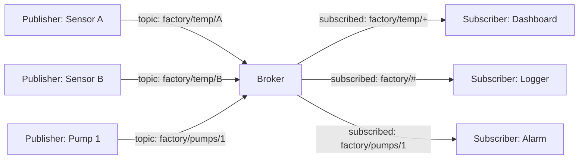
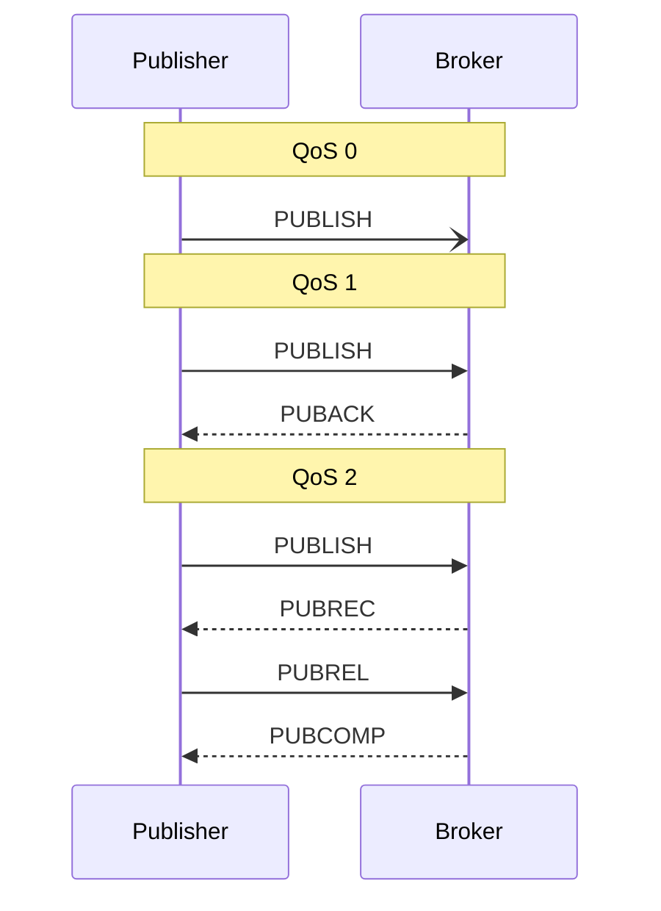

# MQTT Driver (Pro)

MQTT is the protocol of choice when you have many devices, a network in the middle, and you don't want any of the senders or receivers to know about each other directly. It's the dominant pub/sub protocol in IoT for good reasons: tiny header, robust over flaky networks, well-supported on every constrained microcontroller, and easy to bridge into a dashboard.

This page is the primer. For step-by-step Serial Studio setup (broker connection, topics, QoS, TLS), go to [MQTT Integration](MQTT-Integration.md).

## What is MQTT?

MQTT stands for **Message Queuing Telemetry Transport**, a name that's only sort of accurate. It's not really queuing in the traditional sense, but the publish/subscribe and "telemetry over unreliable links" parts hold up. The protocol was originally designed in 1999 by IBM for monitoring oil pipelines over satellite links and standardized as an OASIS specification in 2014. The current version is MQTT 5.0 (2019), with 3.1.1 still extremely common in the wild.

The whole point of MQTT is decoupling. Publishers and subscribers don't connect to each other. They connect to a **broker**, and the broker handles routing.



A new publisher coming online doesn't tell the subscribers anything; it just publishes to a topic, and any subscriber listening to that topic gets the message. A new subscriber doesn't tell the publishers anything; it just subscribes to a topic pattern, and the broker routes new messages to it. Add or remove either side without coordinating.

### Topics

Topics are hierarchical strings separated by `/`:

```
factory/floor1/zone3/temperature
home/livingroom/sensors/humidity
serial-studio/devices/esp32-001/data
```

There's no schema enforced by the broker — topics are just strings — but conventions matter for subscribers. Common practice is to put the most general scope first and the most specific last.

Subscribers can use **wildcards**:

- `+` matches exactly one level. `factory/+/temperature` matches `factory/floor1/temperature` and `factory/floor2/temperature` but not `factory/floor1/zone3/temperature`.
- `#` matches all remaining levels. `factory/#` matches everything starting with `factory/`. Must be the last character.

### Quality of Service (QoS)

MQTT publishes can carry one of three QoS levels:

| QoS | Name             | Guarantees |
|-----|------------------|-----------|
| 0   | At most once     | Fire and forget. The message is sent, and it's gone. No retransmission, no ack. May be lost. |
| 1   | At least once    | The publisher resends until it gets a PUBACK from the broker. The subscriber may receive duplicates. |
| 2   | Exactly once     | Four-way handshake (PUBLISH → PUBREC → PUBREL → PUBCOMP). Guaranteed delivery, no duplicates. Slowest. |

For telemetry, **QoS 0** is usually fine: if a temperature reading is lost, the next one is on its way. **QoS 1** is the right pick when you can't tolerate loss but can tolerate duplicates (the application deduplicates). **QoS 2** is reserved for "must arrive exactly once" cases like billing events; rarely worth it for streaming data.



### Retained messages

A publisher can mark a message as **retained**. The broker remembers the last retained message on each topic, and any new subscriber to that topic gets the retained message immediately on subscribe. This is how you signal "current state" rather than "events":

- `home/heating/setpoint` retained = the current setpoint, available to anyone who subscribes.
- `home/heating/events/setpoint-changed` non-retained = the change events, only seen by clients listening at the time.

Retained messages don't expire (unless MQTT 5 message expiry is set). Publishing an empty payload to a topic with the retain flag clears the retained message.

### Last Will and Testament

When a client connects to the broker, it can register a **Last Will** message: a topic, payload, and QoS that the broker will publish if the client disconnects ungracefully. This is how you detect dead clients — every client publishes a "I'm here" retained message on connect, and a Last Will of "I'm gone" on the same topic. Subscribers always know which clients are alive.

### Sessions and clean session

By default, MQTT 3.x assumes **persistent sessions**. The broker remembers a client's subscriptions and queued messages across disconnects, keyed by the client ID. When the client reconnects, it resumes where it left off.

For interactive clients (a dashboard you connect from your laptop), persistent sessions usually cause more confusion than they solve. **Clean session = on** is the right default for most Serial Studio uses; the broker forgets you between connections.

## How Serial Studio uses it

Serial Studio's MQTT driver wraps Qt MQTT (`QMqttClient`). It can run in two complementary modes:

- **Subscriber mode.** Serial Studio connects to the broker, subscribes to a topic, and treats every received payload as a frame. This is how you ingest telemetry from a fleet of devices into a dashboard.
- **Publisher mode.** Serial Studio reads from another driver (UART, network, BLE, ...), then republishes each parsed frame to an MQTT topic. This is how you bridge a serial device into your IoT infrastructure.

You can run both modes in parallel: subscribe to one topic and publish to another. Serial Studio runs the MQTT client on Qt's event loop on the main thread, like every other driver that doesn't need a worker thread.

For step-by-step setup (broker URL, topics, TLS, authentication, MQTT 5 features), see [MQTT Integration](MQTT-Integration.md).

## Common pitfalls

- **Connection refused / authentication failed.** Re-verify the broker hostname, port, username, and password from another tool first (Mosquitto's `mosquitto_sub` or the MQTT Explorer GUI). Eliminate the broker as the variable before debugging Serial Studio.
- **Subscribed but no data.** Check the topic spelling. Topics are case-sensitive. `Factory/Temp` is not the same as `factory/temp`. Also check whether the publisher is using a different topic level structure than you expected — `mosquitto_sub -t '#' -v` shows you everything the broker has, useful for discovery.
- **Connected but messages don't appear in real-time.** A retained message under a different topic level may be hiding the live one. Subscribe to `your/topic/#` to see everything in that hierarchy.
- **Client ID conflict.** MQTT brokers enforce unique client IDs per connection. If two Serial Studio instances use the same client ID, the broker disconnects the older one. Set distinct client IDs per instance.
- **TLS errors.** If the broker requires TLS (`mqtts://` on port 8883), Serial Studio needs the broker's CA certificate. Self-signed certs require importing the CA explicitly. See [MQTT Integration](MQTT-Integration.md) for TLS setup.
- **Latency adds up over public brokers.** A free public broker like `test.mosquitto.org` round-trips through the public Internet. For low-latency telemetry, run a local broker (Mosquitto on the same LAN, or Docker on your machine).
- **High-rate publishing falls behind.** MQTT is not a streaming protocol. At thousands of messages per second, broker queues can back up, especially over slow networks. Batch multiple readings into a single MQTT message if you don't need per-reading granularity.

## References

- [MQTT 2026 Guide — HiveMQ Essentials](https://www.hivemq.com/mqtt/)
- [MQTT Publish/Subscribe Architecture — HiveMQ Essentials Part 2](https://www.hivemq.com/blog/mqtt-essentials-part2-publish-subscribe/)
- [MQTT Quality of Service Levels — HiveMQ Essentials Part 6](https://www.hivemq.com/blog/mqtt-essentials-part-6-mqtt-quality-of-service-levels/)
- [Retained Messages in MQTT — HiveMQ Essentials Part 8](https://www.hivemq.com/blog/mqtt-essentials-part-8-retained-messages/)
- [MQTT Topics, Wildcards, & Best Practices — HiveMQ Essentials Part 5](https://www.hivemq.com/blog/mqtt-essentials-part-5-mqtt-topics-best-practices/)
- [mqtt.org — official MQTT site](https://mqtt.org/)

## See also

- [MQTT Integration](MQTT-Integration.md) — full Serial Studio MQTT setup, including TLS, MQTT 5 features, and publishing options.
- [Drivers — Network](Drivers-Network.md) — raw TCP/UDP, when you don't need a broker.
- [Communication Protocols](Communication-Protocols.md) — overview of all supported transports.
