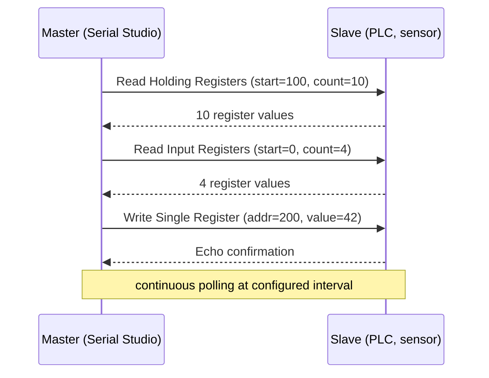
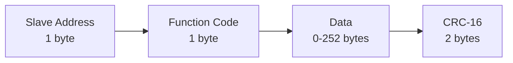
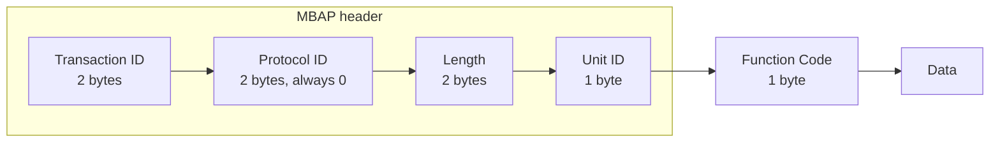

# Modbus Driver (Pro)

Modbus is the industrial protocol that refused to die. Designed in 1979 by Modicon for their PLCs, it is now a de-facto standard across factory automation, building management, energy metering, and process control. If you're connecting Serial Studio to anything older than 10 years on a factory floor or anywhere with the words "PLC", "RTU", or "SCADA" nearby, Modbus is probably how it talks.

Serial Studio Pro implements both **Modbus RTU** (over serial) and **Modbus TCP** (over Ethernet), and ships a [register-map importer](Auto-Generating-Projects.md) that turns vendor CSV/XML/JSON into a working project automatically.

## What is Modbus?

Modbus is a **request/response, master/slave protocol** for reading and writing memory locations on a remote device. The model is intentionally simple:

- Every Modbus device exposes a flat memory map, divided into four register tables (more on this below).
- A **master** sends a request frame containing a function code (what to do) and addresses (where in the memory map).
- The **slave** replies with the requested data or an error.

There is no streaming, no events, no push notifications. The master polls; the slave answers. If you want continuous data, you poll continuously.

### The four register tables

Modbus organizes data into four tables, distinguished by **read/write capability** and **bit width**:

| Table              | Width    | Access | Typical use                           |
|--------------------|----------|--------|---------------------------------------|
| **Coils**          | 1 bit    | R/W    | Digital outputs (relays, valves)      |
| **Discrete inputs**| 1 bit    | R only | Digital inputs (switches, sensors)    |
| **Input registers**| 16 bits  | R only | Analog inputs (sensor readings)       |
| **Holding registers**| 16 bits | R/W   | General-purpose storage (setpoints, configuration, scratch values) |

In real-world devices, the boundaries are fuzzy. A modern temperature transmitter might expose its current reading as a holding register (writable in principle, but writing has no effect) just because that's what the firmware engineer chose. Read your device's documentation; don't assume.

Addresses inside each table go from 0 to 65535. Confusingly, vendors document addresses two ways:

- **PLC numbering** (1-based, table-prefixed): `40001`–`49999` for holding, `30001`–`39999` for input, etc.
- **Protocol numbering** (0-based, no prefix): `0`–`65535` per table.

Modbus on the wire uses protocol numbering. PLC numbering is just a vendor convention. Holding register `40100` in PLC numbering is **address 99** in protocol numbering. Off-by-one is the most common Modbus debugging story in the world.

### Function codes

Every Modbus request carries a one-byte **function code** identifying what to do. The common ones:

| Code | Function | Tables it touches |
|------|----------|-------------------|
| 1    | Read Coils | Coils |
| 2    | Read Discrete Inputs | Discrete inputs |
| 3    | Read Holding Registers | Holding registers |
| 4    | Read Input Registers | Input registers |
| 5    | Write Single Coil | Coils |
| 6    | Write Single Register | Holding registers |
| 15   | Write Multiple Coils | Coils |
| 16   | Write Multiple Registers | Holding registers |

There are more (read/write combined, file records, diagnostics) but those eight cover 95% of real-world traffic.

### Multi-register data types

A Modbus register is 16 bits. Anything bigger spans multiple consecutive registers:

- `uint32` / `int32` / `float32` → 2 registers (4 bytes).
- `uint64` / `int64` / `float64` → 4 registers (8 bytes).

The **byte and word order** is up to the device:

- **Big-endian** (most common): high-order byte first, high-order word first. `0x1234 5678` in two registers reads as register A = `0x1234`, register B = `0x5678`.
- **Little-endian word swap**: register A = `0x5678`, register B = `0x1234`. Common on some legacy gear.
- **Mixed**: byte-swap inside each register but not between. Rare but it happens.

Vendor docs always specify which one. Serial Studio's register-map importer handles big-endian by default (which is what most modern devices use); if your device is different, edit the generated frame parser.

### RTU vs TCP

Modbus rides on top of two transports:

#### Modbus RTU

The original. Runs over RS-232, RS-485, or RS-422. Each frame is wrapped with a **slave address** (1 byte, identifies which device on a multi-drop bus), the function code, the data, and a **CRC-16** checksum. Frames are separated by a 3.5-character idle gap on the line.

RTU runs on RS-485 most of the time, supporting up to 247 slaves on the same pair of wires. Each slave has a unique address (1–247); address 0 is reserved for broadcast.

#### Modbus TCP

The Ethernet variant. Wraps Modbus PDUs in a TCP stream. The frame format is different:

There's no CRC because TCP already handles error detection. The **Unit ID** is the equivalent of the slave address (used when the TCP-to-RTU gateway fronts a multi-drop RS-485 bus). For native Modbus TCP devices it's typically 1 or 255.

The standard Modbus TCP port is **502**.

## How Serial Studio uses it

Serial Studio is the **master** (Modbus client). It can poll any number of slaves on the same physical link.

### Configuration model

Setup is a hierarchy:

1. **Connection.** pick RTU (serial port + baud) or TCP (host + port).
2. **Slave address.** 1–247 for RTU, Unit ID for TCP.
3. **Register groups.** one per contiguous block of same-type registers you want to read. Each group has:
   - Register type (coils, discrete inputs, holding, input).
   - Starting address (0-based, protocol numbering).
   - Count of registers to read in one request.
4. **Poll interval.** how often Serial Studio re-issues all the read requests.

For each poll cycle, Serial Studio iterates through every configured register group, sends the read request, parses the response, and emits a frame containing all the read values. Your frame parser then extracts named datasets from those values.

### Auto-generation

For devices with documented register maps, the [Modbus map importer](Auto-Generating-Projects.md) reads vendor CSV/XML/JSON files and generates the register groups, datasets, and a complete Lua frame parser automatically. Most of the time you'll start there rather than hand-configuring registers.

### Threading

The Modbus driver wraps Qt's `QModbusClient` and runs on the main thread. Polling is event-driven (no busy loop); Qt's async I/O delivers responses via signals. See [Threading and Timing Guarantees](Threading-and-Timing.md).

For step-by-step setup, see the [Protocol Setup Guides → Modbus section](Protocol-Setup-Guides.md).

## Common pitfalls

- **"No response from slave."** Verify the slave address. PLCs from different vendors default to different addresses (1 is common, but not universal). Check the wiring on RS-485: A-to-A, B-to-B, plus a common ground if the bus spans different power domains.
- **Off-by-one address.** PLC numbering vs protocol numbering. If the docs say "holding register 40101", you want protocol address **100**, not 40101 and not 101.
- **CRC errors on RTU.** Almost always a wiring or termination issue. RS-485 buses need 120 Ω terminators at each end of the trunk. Stub branches longer than a few inches at high baud rates corrupt the CRC.
- **Wrong byte order for 32-bit values.** Read raw 16-bit registers, look at the bytes, compare to the vendor doc. Most modern devices are big-endian word, big-endian byte. If your float reads as `1.234e-23`, you're decoding the wrong endianness.
- **Polling too fast.** Some devices, especially older PLCs, can't process requests faster than one every 100 ms or so. Serial Studio happily polls at 10 ms; the device may simply not respond. Slow it down.
- **TCP works but RTU doesn't.** RS-485 is a hostile electrical environment. Long cables, missing ground, intermittent termination, biasing resistor needed (some adapters lack pull-up/pull-down on the bus when idle). Get an oscilloscope on the line if you're stuck.
- **"Illegal data address" exception.** The slave's memory map doesn't have that register. Re-check the vendor docs. Some PLCs only respond to addresses that are actually configured in their program; others allow reads of any address.
- **Slave responds slowly under load.** Modern Modbus TCP is fine. Modbus RTU at 9600 baud is slow by design. A 60-register read is ~12 ms of wire time alone, plus device processing. Don't expect kilohertz polling on serial.

## References

- [Modbus — Wikipedia](https://en.wikipedia.org/wiki/Modbus)
- [Modbus Protocol Overview — modbustools.com](https://www.modbustools.com/modbus.html)
- [Modbus RTU Made Simple — IPC2U](https://ipc2u.com/articles/knowledge-base/modbus-rtu-made-simple-with-detailed-descriptions-and-examples/)
- [What is Modbus & How Does It Work — NI](https://www.ni.com/en/shop/seamlessly-connect-to-third-party-devices-and-supervisory-system/the-modbus-protocol-in-depth.html)
- [Introduction to Modbus and Modbus Function Codes — Control.com](https://control.com/technical-articles/introduction-to-modbus-and-modbus-function-codes/)
- [modbus.org — official Modbus site](https://modbus.org/)

## See also

- [Auto-Generating Projects](Auto-Generating-Projects.md): Modbus register-map import (CSV/XML/JSON).
- [Protocol Setup Guides](Protocol-Setup-Guides.md): step-by-step Modbus setup.
- [Data Sources](Data-Sources.md): driver capability summary across all transports.
- [Communication Protocols](Communication-Protocols.md): overview of all supported transports.
- [Use Cases](Use-Cases.md): industrial monitoring and PLC integration examples.
- [Troubleshooting](Troubleshooting.md): wiring, addressing, and CRC-error diagnostics.
- [Drivers — UART](Drivers-UART.md): RTU rides on serial; the UART page covers RS-485 physical layer.
- [Drivers — Network](Drivers-Network.md): TCP transport details.
- [Drivers — CAN Bus](Drivers-CAN-Bus.md): the other big industrial protocol.
