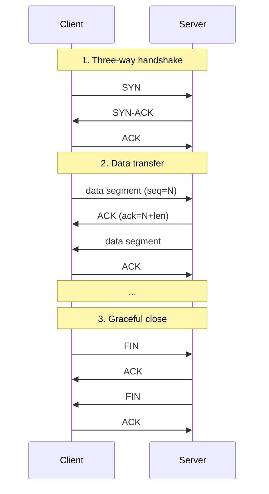
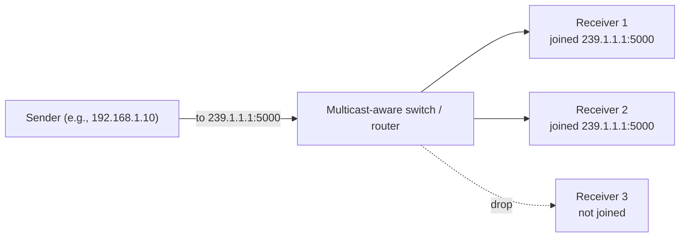

# Network Driver (TCP / UDP)

Once a project outgrows a single USB cable, the next step is usually a network socket. Serial Studio's Network driver speaks two transport protocols:

- **TCP**, for reliable, ordered, connection-oriented streams.
- **UDP**, for low-overhead, connectionless datagrams, including multicast.

The driver is in the free build. It's the right transport when your device is on a different machine, behind a network gateway, on a Wi-Fi link, or being shared between multiple Serial Studio instances.

## What is TCP?

TCP, the **Transmission Control Protocol**, was specified in [RFC 793](https://www.rfc-editor.org/rfc/rfc793) in 1981 and is still the workhorse of the Internet. It gives you a reliable, ordered stream of bytes between two endpoints, hides packet loss, retransmits what's missing, and enforces flow control so the sender doesn't drown the receiver.

### How TCP looks on the wire

A TCP connection has three phases:

Once the handshake completes, both sides see a virtual full-duplex pipe: write bytes in one end, the same bytes come out the other end, in order, with nothing missing. TCP does this on top of an unreliable IP network by numbering every byte, acknowledging what it received, and retransmitting anything that doesn't get acknowledged in time.

### Stream, not message

The most important thing to understand about TCP: **it is a stream of bytes, not a stream of messages.** If your device writes 100 bytes followed by 100 bytes, the receiver may see one read of 200 bytes, or two reads of 100, or 200 reads of 1. The boundaries are not preserved.

This matters for Serial Studio because frame parsing has to work on a stream. If you separate frames with a delimiter (newline, custom byte sequence), Serial Studio's FrameReader will find them in the stream regardless of how the OS chunked them. If you use fixed-length frames, the FrameReader counts bytes. Either way works; just don't assume "one TCP packet = one frame."

### Ports

Every TCP endpoint is `(IP address, port number)`. Ports go from 0 to 65535. 0–1023 are "well-known" (reserved for system services on most operating systems); 1024–49151 are "registered" (database servers, application services); 49152–65535 are "ephemeral" (assigned to outgoing client connections by the OS).

Serial Studio doesn't enforce any choice. Pick whatever your device is configured to use.

## What is UDP?

UDP, the **User Datagram Protocol**, was specified in [RFC 768](https://www.rfc-editor.org/rfc/rfc768) in 1980. Its entire spec is three pages. Where TCP gives you a reliable stream, UDP gives you something far simpler: **fire one packet, hope it arrives, no guarantees.**

UDP's header is 8 bytes: source port, destination port, length, checksum. There is no handshake, no acknowledgment, no retransmission, no ordering, no flow control. If a packet is lost, it's gone. If two packets arrive out of order, you see them out of order.

### When you'd choose UDP over TCP

- **Real-time data where freshness beats reliability.** Live sensor readings at high rates: if a packet drops, the next one is already on its way and is more current. Retransmitting an old reading is worse than skipping it.
- **One-to-many distribution (multicast).** TCP can't multicast; UDP can.
- **Low overhead.** UDP avoids the per-connection state and the handshake. Useful when the device is a small microcontroller with limited RAM.
- **Discovery and beacons.** "I'm here, my IP is X" announcements are a fit for UDP broadcast or multicast.

UDP is the right choice when **either** the data is naturally datagram-shaped (one self-contained reading per packet) **or** you'd rather drop a stale message than wait for it.

### Multicast

UDP supports a special form of distribution called **multicast**, where one sender publishes to a multicast group address and any number of receivers can subscribe to that group. The network (routers and switches that support it) replicates packets only where receivers exist.

Multicast group addresses are in the IP range `224.0.0.0` to `239.255.255.255`. The most useful sub-range for application use is `239.0.0.0/8` (administratively scoped, organization-local).

Receivers join a group by sending an **IGMP** (Internet Group Management Protocol) Membership Report. The router then forwards the multicast traffic on that interface. When the receiver leaves, it sends an IGMP Leave message and the router stops forwarding. Without IGMP support in the network, multicast falls back to flood-everywhere or fails entirely.

For Serial Studio, multicast is useful when:

- Multiple dashboards on a LAN need to see the same telemetry without each opening a separate TCP connection to the source.
- The data source is a CAN-to-UDP gateway that publishes a multicast group per CAN bus.
- You're integrating with industrial multicast publishers (some PLCs, OPC UA Pub/Sub, audio-over-IP systems).

## How Serial Studio uses it

The Network driver wraps Qt's `QTcpSocket` (client mode), `QTcpServer` (server mode), and `QUdpSocket`. The driver lives on the main thread and uses Qt's async I/O; no dedicated thread (see [Threading and Timing Guarantees](Threading-and-Timing.md)).

You configure four things:

| Setting | Controls |
|---------|----------|
| **Protocol** | TCP or UDP |
| **Mode** (TCP) | Client (Serial Studio dials out) or Server (Serial Studio listens for incoming connections) |
| **Mode** (UDP) | Receiver, Sender, or Multicast |
| **Address** | Remote IP / hostname (TCP client, UDP sender) or local interface (TCP server, UDP receiver) |
| **Port** | TCP/UDP port number |

For multicast UDP, the address is the multicast group (e.g. `239.1.1.1`) and Serial Studio joins the group on connect. For multicast send, the destination address is the group; the OS handles IGMP transparently.

Setup steps live in the [Protocol Setup Guides → Network section](Protocol-Setup-Guides.md).

## Common pitfalls

- **"Serial Studio can't connect" with TCP client mode.** Check whether the device or remote service is actually listening. From a terminal, `telnet host port` (or `nc host port`) tries the same connection; if it fails, the problem is the network or the remote, not Serial Studio.
- **Firewall blocks the port.** On Windows, the Windows Firewall pop-up may have been dismissed without granting access. Re-allow Serial Studio in Windows Firewall settings. On Linux, `ufw status` shows whether the port is blocked.
- **Address already in use (TCP server, UDP receiver).** Another process is bound to the same port. Find it with `netstat -an | findstr :7777` (Windows) or `lsof -i :7777` (Linux/macOS).
- **UDP packets arrive out of order or get lost.** That's UDP working as designed, not a bug. If you can't tolerate it, switch to TCP. Or layer your own sequence numbers on top.
- **Multicast traffic doesn't reach the receiver across subnets.** Most home routers don't forward multicast across VLANs without explicit IGMP snooping configuration. Multicast is reliable on a single LAN segment; cross-subnet routing is a network admin problem.
- **TCP appears slow on Windows.** Nagle's algorithm is on by default and bunches small writes together to amortize header overhead. For interactive serial-style streams it can add up to 200 ms of latency. Most embedded TCP stacks let you disable Nagle (TCP_NODELAY); Serial Studio sets this where Qt allows.
- **A "raw TCP socket" still imposes structure.** TCP is a byte stream and frame boundaries are the application's responsibility. If your device sends `frame1frame2frame3` with no delimiter and no length prefix, you can't parse it. Add a delimiter (newline) or a length-prefix.

## References

- [RFC 793 — Transmission Control Protocol (TCP)](https://www.rfc-editor.org/rfc/rfc793)
- [RFC 768 — User Datagram Protocol (UDP)](https://www.rfc-editor.org/rfc/rfc768)
- [Internet Group Management Protocol — Wikipedia](https://en.wikipedia.org/wiki/Internet_Group_Management_Protocol)
- [What is IGMP? — Cloudflare Learning Center](https://www.cloudflare.com/learning/network-layer/what-is-igmp/)
- [User Datagram Protocol — Wikipedia](https://en.wikipedia.org/wiki/User_Datagram_Protocol)
- [The Difference Between TCP and UDP Explained — Linode Docs](https://www.linode.com/docs/guides/difference-between-tcp-and-udp/)

## See also

- [Protocol Setup Guides](Protocol-Setup-Guides.md): step-by-step Network setup in the Setup Panel.
- [Data Sources](Data-Sources.md): driver capability summary across all transports.
- [Communication Protocols](Communication-Protocols.md): overview of all supported transports.
- [MQTT Integration](MQTT-Integration.md): when you need pub/sub semantics on top of TCP.
- [Troubleshooting](Troubleshooting.md): firewall, port-conflict, and connectivity diagnostics.
- [Drivers — UART](Drivers-UART.md): the physical-layer alternative when both ends are local.
- [Drivers — MQTT](Drivers-MQTT.md): pub/sub on top of TCP, when you have many publishers/subscribers and a broker.
- [API Reference](API-Reference.md): Serial Studio's own JSON-RPC TCP API on port 7777.
