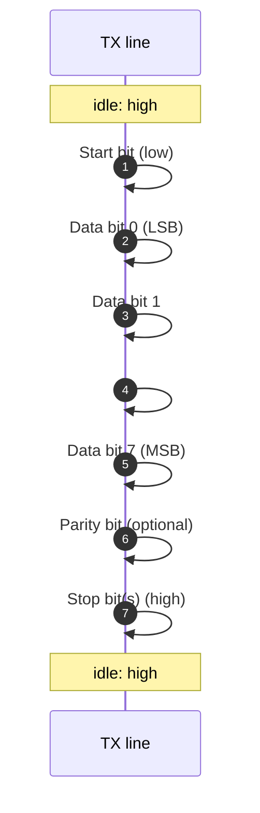

# UART / Serial Driver

The UART driver is the original Serial Studio driver and still the most-used one. It handles plain serial communication: USB-to-serial adapters, RS-232 ports, RS-485 buses, and Bluetooth Classic SPP profiles that present themselves as virtual COM ports.

If you've never worked with a serial port before, start at the top. If you're here for the configuration reference, skip to **Configuration in Serial Studio**.

## What is UART?

UART stands for **Universal Asynchronous Receiver-Transmitter**. It is a small piece of hardware (in a microcontroller, a USB-to-serial chip, or a PC's chipset) that converts parallel bytes into a sequential stream of bits and back, with no shared clock between sender and receiver. The "asynchronous" part is the whole point: there are only two data wires (TX and RX), no clock line. Both sides agree in advance on how fast bits will fly past, and the receiver synchronizes itself to the start of every byte.

A UART is **a peripheral, not a protocol**. The protocol it implements is sometimes called "asynchronous serial" or just "serial". When people say "this device speaks serial at 115200 8N1," they're describing UART parameters.

### The frame

Every byte sent over a UART line is wrapped in a small fixed-shape frame:

Wire conventions:

- **Idle** is logic high. The line sits high when nothing is being sent.
- **Start bit** drops the line low for one bit-time. This is the receiver's signal to start clocking in bits.
- **Data bits** follow, least-significant first, typically 8 of them (sometimes 5, 6, 7, or 9).
- **Parity bit**, if enabled, makes the total number of `1` bits in the frame either always even (even parity) or always odd (odd parity). It catches single-bit errors.
- **Stop bit(s)** return the line high for at least 1 (sometimes 1.5 or 2) bit-times before the next start bit.

The most common configuration is **8N1**: 8 data bits, **n**o parity, **1** stop bit. Counting the start and stop bits, that's 10 bits on the wire per byte, so the protocol's raw efficiency is 80%.

### Baud rate

**Baud rate** is the number of symbols per second on the line. For a UART that's the same as bits per second. If you set 9600 baud, each bit is on the wire for `1 / 9600 ≈ 104.2 microseconds`.

Common baud rates: 9600, 19200, 38400, 57600, 115200, 230400, 460800, 921600. Most modern USB-serial chips and microcontrollers support up to 1 Mbps or higher.

Both ends must agree. UARTs are tolerant to small clock mismatches but only up to about ±10% between sender and receiver before a single byte starts losing bits. The receiver clocks at a multiple of the baud rate (typically 8× or 16×), samples each data bit near its midpoint, and is forgiving of small timing drift across one frame, but if you mismatch the baud rate (115200 vs 9600), you'll get garbage data or no data at all.

### Parity

A parity bit is a single bit appended to the data that makes the total number of `1`s in the frame either always even or always odd. It catches single-bit errors but cannot detect two-bit errors and cannot correct anything. Most modern designs skip parity (`N` for "none") because USB and short cables rarely flip bits, and any error detection that matters happens at a higher layer (CRC at the application level).

Parity options Serial Studio exposes:

- **None** — no parity bit. Most common.
- **Even** — total `1`s is always even.
- **Odd** — total `1`s is always odd.
- **Mark** — parity bit always `1`. Niche, used for inter-byte signaling on some legacy buses.
- **Space** — parity bit always `0`. Niche.

### Stop bits

The stop bit holds the line high for one or two bit-times after the last data bit. Two stop bits are sometimes used at very low baud rates (300 baud, telephone-era modems) to give a slow receiver more time to process a byte before the next one arrives. At anything above 9600 baud, **1 stop bit** is the right choice unless your device specifically requires otherwise.

### Flow control

Flow control is the mechanism that lets the receiver tell the sender "wait, my buffer is full, hold off." Two kinds matter for UART:

- **Hardware flow control (RTS/CTS).** Two extra wires. The receiver raises CTS (Clear To Send) when it can accept data, and lowers it when it can't. The sender checks CTS before each byte. Hardware flow control is reliable but requires the right cable wiring.
- **Software flow control (XON/XOFF).** Special characters in the data stream (`0x11` = XON, `0x13` = XOFF) signal "go" and "stop". This consumes those byte values, so it can't be used with binary data.
- **None.** No flow control. Best when both sides are fast enough to never need to pause, or when the protocol layered on top has its own back-pressure (most modern microcontroller streams).

For typical Arduino, ESP32, and STM32 telemetry, **None** is correct. Hardware flow control matters when you're talking to industrial gear or pumping data fast enough that the host can't keep up at the application layer.

### RS-232 vs RS-485 vs TTL

UART is the protocol; the **physical layer** is something else. Serial Studio doesn't care which one you use as long as the OS exposes a serial port, but it helps to know the differences:

- **TTL serial** — 0 V and 3.3 V (or 5 V) logic levels. What microcontroller pins speak directly. Short cables only.
- **RS-232** — ±3 to ±15 V (typically ±12 V), single-ended, full-duplex (separate TX and RX wires). Cable lengths up to ~15 m. The classic 9-pin DE-9 connector. PC serial ports.
- **RS-485** — Differential signaling on two wires (A and B), tolerant to 1200 m of cable, supports multi-drop buses (one master + many slaves on the same pair). Native operation is half-duplex but a 4-wire variant supports full-duplex. The physical layer Modbus RTU and many industrial buses ride on.

When you plug a USB-to-serial adapter into your laptop, the chip on the cable converts USB to TTL or RS-232 levels. From Serial Studio's point of view, all of these look like a COM port (Windows) or `/dev/ttyUSB0` / `/dev/tty.usbserial-XXXX` (Linux/macOS).

## How Serial Studio uses it

Serial Studio's UART driver wraps Qt's `QSerialPort`. The configuration surface exposed in the Setup Panel maps one-to-one to UART parameters:

| Setting | Controls |
|---------|----------|
| **Port** | Which OS-level serial device to open (COM3, `/dev/ttyACM0`, etc.) |
| **Baud rate** | Bits per second |
| **Data bits** | 5 / 6 / 7 / 8 |
| **Parity** | None / Even / Odd / Mark / Space |
| **Stop bits** | 1 / 1.5 / 2 |
| **Flow control** | None / Hardware (RTS/CTS) / Software (XON/XOFF) |
| **DTR enabled** | Asserts the DTR line on connect (some boards reset on DTR toggle, e.g. Arduino) |
| **Auto reconnect** | Reopens the port if the device disappears and comes back |

The driver runs on top of `QSerialPort`, which uses Qt's event loop for non-blocking reads. There's no dedicated thread; bytes arrive on the main thread and feed the FrameReader directly. See [Threading and Timing Guarantees](Threading-and-Timing.md) for why that's the right choice.

For setup steps, see the [Protocol Setup Guides → Serial/UART section](Protocol-Setup-Guides.md).

## Common pitfalls

- **The Arduino keeps resetting on connect.** That's the DTR line toggling. Boards with a USB-CDC bootloader (Uno, Nano, ESP8266 with auto-reset circuit) interpret a DTR pulse as "reset and enter bootloader." Disable **DTR enabled** in the driver settings, or in the Arduino IDE world set the port to a CH340/FTDI-style adapter that lets you control DTR independently.
- **Garbled output that looks "almost right".** Baud-rate mismatch. If half the bytes look fine and half are random, you're probably one factor of 2 off (115200 set, device sending 57600).
- **Nothing comes through but the port opens fine.** Check TX/RX aren't swapped. Some adapters label pins from the host's perspective, some from the device's. The fix is usually to swap TX and RX physically.
- **Long cable runs drop bytes.** TTL or RS-232 don't handle distance well. Switch to RS-485 transceivers on both ends and you'll get reliable communication over 100+ meters.
- **Device disappears mid-session on Linux.** `udev` may have renamed it. `/dev/ttyUSB0` can become `/dev/ttyUSB1` after a hot-unplug. A `udev` rule pinning the device by VID/PID to a stable symlink solves it permanently.

## References

- [Universal asynchronous receiver-transmitter — Wikipedia](https://en.wikipedia.org/wiki/Universal_asynchronous_receiver-transmitter)
- [UART: A Hardware Communication Protocol — Analog Devices](https://www.analog.com/en/resources/analog-dialogue/articles/uart-a-hardware-communication-protocol.html)
- [Basics of UART Communication — Circuit Basics](https://www.circuitbasics.com/basics-uart-communication/)
- [RS-485 — Wikipedia](https://en.wikipedia.org/wiki/RS-485)
- [The main differences between RS-232, RS-422 and RS-485 — IPC2U](https://ipc2u.com/articles/knowledge-base/the-main-differences-between-rs-232-rs-422-and-rs-485/)

## See also

- [Protocol Setup Guides](Protocol-Setup-Guides.md) — step-by-step UART setup in the Setup Panel.
- [Operation Modes](Operation-Modes.md) — Quick Plot vs Project File vs Console-only.
- [Communication Protocols](Communication-Protocols.md) — overview of all supported transports.
- [Drivers — Network](Drivers-Network.md) — TCP and UDP, the next step up when serial isn't enough.
