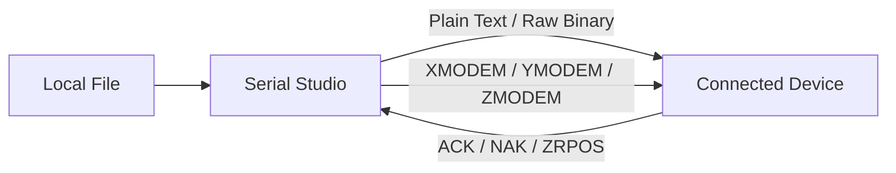

# File transmission

Serial Studio can send files to a connected device using plain text, raw binary, or industry-standard transfer protocols (XMODEM, XMODEM-1K, YMODEM, ZMODEM). It's handy for uploading firmware, configuration files, scripts, or any other data to an embedded target over an active connection.

> **Availability.** File transmission ships in the public release starting with version 4.0.0. The toolbar entry appears in commercial builds only; GPL builds compiled from source do not include it.

## Protocol overview

| Mode        | Error detection  | Block size  | Pause/resume     | Best for |
|-------------|------------------|-------------|------------------|----------|
| Plain Text  | None             | Line-based  | Yes              | Human-readable config files, AT commands |
| Raw Binary  | None             | 64-8192 B   | Yes              | Simple binary uploads without protocol overhead |
| XMODEM      | CRC-16           | 128 B       | No               | Legacy devices, small files |
| XMODEM-1K   | CRC-16           | 1024 B      | No               | Legacy devices, larger files |
| YMODEM      | CRC-16           | 1024 B      | No               | Files where the receiver needs the filename and size |
| ZMODEM      | CRC-32           | 64-8192 B   | Crash recovery   | Large files, unreliable links, modern firmware loaders |

## Opening the File Transmission dialog

Open **File Transmission** from the dashboard taskbar, or from Start Menu → Tools → File Transmission, while a device connection is active. The dialog closes automatically if the connection drops.

## Transfer modes

### Plain text

Sends the file line by line as text. Each line is terminated with a newline. A good fit for sending scripts, AT command sequences, or configuration files to devices that process text input.

Configuration sets the transmission interval, the delay between consecutive lines (range and default in the [Settings reference](#settings-reference) below). Raise it if the device needs time to process each line before accepting the next.

**Behavior:**

- Lines are read sequentially from the file.
- A newline is appended automatically if the line doesn't already end with one.
- You can pause and resume transmission. It continues from where it left off.

### Raw binary

Sends the file in fixed-size binary blocks with no framing or error checking. Use this when the receiver expects raw bytes and handles its own integrity checks.

Configuration sets the block size and the transmission interval between blocks (ranges and defaults in the [Settings reference](#settings-reference) below).

**Behavior:**

- The file is read in sequential chunks of the configured block size.
- The last block may be smaller than the configured size.
- You can pause and resume transmission.

### XMODEM

A classic byte-oriented protocol that sends data in 128-byte blocks with CRC-16 error detection. The receiver initiates the transfer by sending a `C` character to request CRC mode.

Configuration sets the timeout for receiver responses and the number of retry attempts per block on NAK or timeout (ranges and defaults in the [Settings reference](#settings-reference) below).

**Protocol flow:**

1. Serial Studio waits for the receiver to send `C` (CRC mode request).
2. Each 128-byte block is sent with a sequence number and CRC-16 checksum.
3. The receiver responds with ACK (success) or NAK (retransmit).
4. After all blocks are sent, Serial Studio sends EOT to signal completion.

**Notes:**

- Files smaller than 128 bytes are padded to fill the block.
- Only CRC-16 mode is supported (not the legacy checksum mode).

### XMODEM-1K

Identical to XMODEM but uses 1,024-byte blocks instead of 128-byte, which cuts protocol overhead for larger files.

**Configuration:**

- Same as XMODEM: **Timeout** and **Max retries**.

### YMODEM

Extends XMODEM-1K with a metadata block that carries the filename and file size, so the receiver knows what it's getting before the data arrives.

**Configuration:**

- Same as XMODEM: **Timeout** and **Max retries**.

**Protocol flow:**

1. Serial Studio sends block 0 with the filename and file size.
2. Data is transmitted in 1,024-byte blocks with CRC-16.
3. After the data, Serial Studio sends EOT (twice, per YMODEM convention).
4. An empty block 0 signals end-of-batch.

**Notes:**

- The receiver can use the file size from block 0 to strip padding from the last block.

### ZMODEM

A streaming protocol that doesn't wait for per-block acknowledgment, which makes it much faster than XMODEM/YMODEM on high-latency or high-throughput links. It uses CRC-32 for stronger error detection and supports crash recovery.

Configuration sets the block size per data subpacket, the timeout for receiver responses, and the number of retry attempts on error (ranges and defaults in the [Settings reference](#settings-reference) below).

**Key features:**

- Data subpackets stream continuously without per-packet ACKs, maximizing throughput.
- Crash recovery: a receiver restarting after an interrupted transfer can request retransmission from a specific file offset (ZRPOS) instead of starting over.
- The ZFILE header carries the filename, size, and modification timestamp.
- Control characters are escaped in transit (ZDLE) so the stream doesn't collide with terminal or modem control sequences.

## Progress and status

During an active transfer, the dialog shows:

- **Progress bar.** Percent of the file transmitted.
- **Transfer speed.** Current throughput in B/s, KB/s, or MB/s.
- **Bytes sent / total.** Absolute byte counters.
- **Error count.** Number of protocol-level errors (NAKs, retries, timeouts). Only incremented during protocol-based transfers.
- **Status text.** Current protocol state or last event.

## Activity log

The bottom section of the dialog has a scrollable activity log with timestamped events: block transmissions, acknowledgments, errors, retries, and completion status. It keeps the most recent 200 entries. Click **Clear** to reset it.

## Settings reference

All settings are saved automatically and restored between sessions.

| Setting                | Applies to                              | Range             | Default    |
|------------------------|-----------------------------------------|-------------------|------------|
| Transmission interval  | Plain Text, Raw Binary                  | 0-10,000 ms       | 100 ms     |
| Block size             | Raw Binary, ZMODEM                      | 64-8,192 bytes    | 1,024 bytes|
| Timeout                | XMODEM, XMODEM-1K, YMODEM, ZMODEM       | 1,000-60,000 ms   | 10,000 ms  |
| Max retries            | XMODEM, XMODEM-1K, YMODEM, ZMODEM       | 1-100             | 10         |

## Tips

- Use ZMODEM when the receiver supports it: streaming transfers give higher throughput, and CRC-32 plus crash recovery handle unreliable links. Fall back to XMODEM/YMODEM otherwise.
- If a slow receiver can't keep up, raise the transmission interval (Plain Text / Raw Binary) or the timeout (protocol modes).
- Smaller block sizes cut the cost of retransmissions on noisy links; 256 or 512 bytes is a good starting point for ZMODEM on unreliable connections.
- XMODEM-1K, YMODEM, and ZMODEM all reduce per-block overhead compared to standard XMODEM for large files.
- Firmware bootloaders often support XMODEM or YMODEM natively; check the device documentation for the expected protocol.

## See also

- [Operator Deployments](Operator-Deployments.md): the `--file-transmission` flag exposes this dialog in runtime-mode builds.
- [Toolbar Reference](Toolbar-Reference.md): where the File Transmission tool lives in the dashboard taskbar and Start Menu.
- [Pro vs Free](Pro-vs-Free.md): edition gating for this feature.
- [Communication Protocols](Communication-Protocols.md): the connections File Transmission sends data over.
