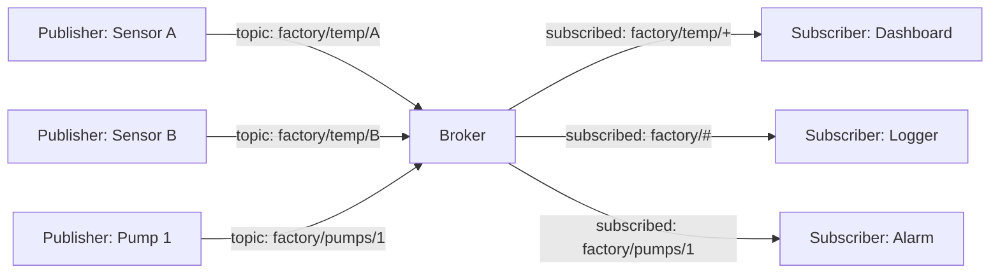
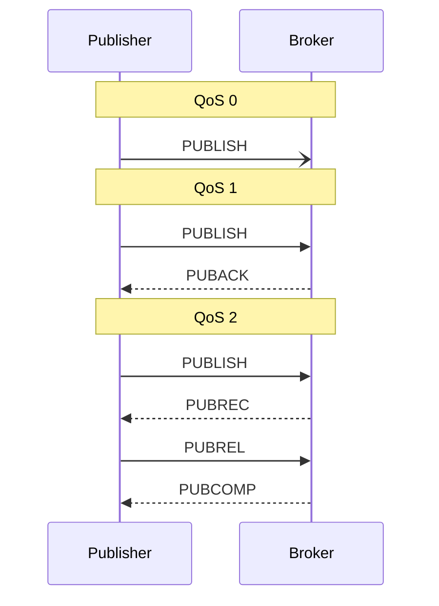
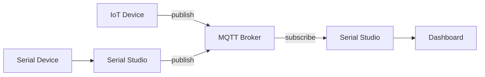

# MQTT Integration (Pro)

MQTT is the standard publish/subscribe protocol for IoT. It is the right transport when many devices share a network and the publishers and subscribers should not need to know about each other directly. The header is small, it is robust over unreliable links, every constrained microcontroller has a client, and bridging it into a dashboard is straightforward.

Serial Studio Pro includes an MQTT client that can subscribe to broker topics to receive telemetry, or publish incoming frame data to a broker for other apps to consume. Unlike UART, BLE, CAN Bus, and the other transports listed under **Drivers**, MQTT does not present a physical bus to Serial Studio. It sits on top of TCP and a broker, so it is documented here in the **Connectivity** section rather than as a hardware driver.

## What is MQTT?

MQTT stands for **Message Queuing Telemetry Transport**. The name is partly historical: MQTT does not provide queuing in the traditional sense, but the publish/subscribe and "telemetry over unreliable links" parts of the name still describe it accurately. The protocol was designed in 1999 by IBM for monitoring oil pipelines over satellite links and standardised as an OASIS specification in 2014. The current version is MQTT 5.0 (2019); MQTT 3.1.1 remains extremely common in the field.

The core idea is decoupling. Publishers and subscribers do not connect to each other. They connect to a **broker**, and the broker handles routing.



A new publisher coming online does not announce itself to subscribers; it publishes to a topic, and any subscriber listening to that topic receives the message. A new subscriber does not announce itself to publishers; it subscribes to a topic pattern, and the broker routes new messages to it. Either side can be added or removed without coordination.

### Topics

Topics are hierarchical strings separated by `/`:

```
factory/floor1/zone3/temperature
home/livingroom/sensors/humidity
serial-studio/devices/esp32-001/data
```

The broker does not enforce a schema (topics are just strings), but conventions matter for subscribers. Common practice is to put the most general scope first and the most specific last.

Subscribers can use **wildcards**:

- `+` matches exactly one level. `factory/+/temperature` matches `factory/floor1/temperature` and `factory/floor2/temperature` but not `factory/floor1/zone3/temperature`.
- `#` matches all remaining levels. `factory/#` matches everything that starts with `factory/`. It must be the last character of the pattern.

### Quality of Service (QoS)

MQTT publishes can carry one of three QoS levels:

| QoS | Name             | Guarantees |
|-----|------------------|-----------|
| 0   | At most once     | Fire and forget. The message is sent, and it's gone. No retransmission, no ack. May be lost. |
| 1   | At least once    | The publisher resends until it gets a PUBACK from the broker. The subscriber may receive duplicates. |
| 2   | Exactly once     | Four-way handshake (PUBLISH → PUBREC → PUBREL → PUBCOMP). Guaranteed delivery, no duplicates. Slowest. |

For telemetry, QoS 0 is usually adequate: if a temperature reading is lost, the next one is already on its way. Choose QoS 1 when loss is unacceptable but duplicates are (the application deduplicates). QoS 2 is for "must arrive exactly once" cases such as billing events and is rarely worth its cost for streaming data.



### Retained messages

A publisher can mark a message as *retained*. The broker remembers the last retained message on each topic and delivers it immediately to any new subscriber. This is the way to signal "current state" rather than "events":

- `home/heating/setpoint` retained: the current setpoint, available to anyone who subscribes.
- `home/heating/events/setpoint-changed` non-retained: the change events, only seen by clients listening at the time.

Retained messages do not expire unless MQTT 5 message expiry is set. Publishing an empty payload to a topic with the retain flag clears the retained message.

### Last Will and Testament

When a client connects, it can register a **Last Will** message: a topic, payload, and QoS that the broker publishes if the client disconnects ungracefully. This is the standard way to detect dead clients. Each client publishes a retained "I'm here" message on connect and a Last Will of "I'm gone" on the same topic; subscribers always know which clients are alive.

### Sessions and clean session

By default MQTT 3.x assumes persistent sessions: the broker remembers a client's subscriptions and queued messages across disconnects, keyed by the client ID. When the client reconnects, it resumes where it left off.

For interactive clients (a dashboard connecting from a laptop) persistent sessions usually cause more confusion than they solve. **Clean session = on** is the right default for most Serial Studio uses; the broker forgets the client between connections.

## How Serial Studio uses it

The MQTT client wraps Qt MQTT (`QMqttClient`) and runs on the main thread's event loop. It can operate in two complementary modes:

- **Subscriber.** Serial Studio connects to the broker, subscribes to a topic filter, and treats every received payload as a frame, exactly as if the bytes had arrived over UART or TCP. Use this to ingest telemetry from a fleet of devices into a dashboard.
- **Publisher.** Serial Studio reads from another data source (UART, network, BLE, ...) and republishes each parsed frame to an MQTT topic. Use this to bridge a serial device into existing IoT infrastructure without modifying the device firmware.

Both modes can run in parallel: subscribe to one topic and publish to another.



## Setup

### Opening the MQTT dialog

Click the **MQTT** button in the toolbar. The MQTT Configuration dialog opens with all connection and protocol settings.

### Broker connection

| Setting        | Description                              | Default                   |
|----------------|------------------------------------------|---------------------------|
| Hostname       | Broker address (IP or hostname)          | `127.0.0.1`               |
| Port           | Broker port                              | `1883`                    |
| Username       | Authentication username (optional)       | Empty                     |
| Password       | Authentication password (optional)       | Empty                     |
| Client ID      | Unique identifier for this client        | Auto-generated (16 chars) |
| Clean session  | Discard previous session state on connect| Enabled                   |

### MQTT version

Pick the protocol version from the dropdown:

- **MQTT 3.1.** Legacy. Widest broker compatibility.
- **MQTT 3.1.1.** Recommended for most brokers. Clearer spec than 3.1.
- **MQTT 5.0.** Latest. Adds shared subscriptions, message expiry, reason codes, and extended authentication.

### Mode

Pick **Subscriber** or **Publisher** (both can be active simultaneously on different topics).

### Topic

Enter the topic in the **Topic Filter** field.

**Subscriber examples:**

- `sensors/temperature`. Receive messages on this exact topic.
- `sensors/+/temperature`. Single-level wildcard. Matches `sensors/room1/temperature`, `sensors/room2/temperature`, and so on.
- `sensors/#`. Multi-level wildcard. Matches everything under `sensors/`.

**Publisher examples:**

- `mydevice/data`. All frames publish to this single topic.

### Connecting

After configuring the settings, click **Connect**. The button label reflects the connection state. Click it again to disconnect (or use `toggleConnection`).

## Subscriber mode

In subscriber mode, Serial Studio subscribes to the configured topic filter as soon as the connection is up. Each message received from the broker is treated as a raw frame, just like the binary or text payload your device would send over serial or network.

**Payload expectations:**

- The message payload should be the frame data without start/end delimiters. Serial Studio wraps it internally.
- For Quick Plot mode: comma-separated numeric values (for example `23.5,48.2,1013.25`).
- For Project File mode: data matching your project's frame parser.
- Console Only mode displays the payload as-is in the terminal, so no special format is expected.

**Example.** If your ESP32 publishes `23.5,48.2,1013.25` to `weather/data`, and Serial Studio subscribes to `weather/data` in Quick Plot mode, the dashboard shows three datasets.

## Publisher mode

In publisher mode, Serial Studio publishes every frame received from the currently connected data source (serial port, network socket, BLE, and so on) to the configured topic. The published payload is the raw frame content between start and end delimiters.

**Example.** If a serial device sends `/*1023,512,850*/` and the publish topic is `mydevice/sensors`, the broker receives `1023,512,850` on that topic.

This mode is useful for bridging a local serial device to a remote MQTT infrastructure without modifying the device firmware.

## TLS/SSL configuration

For encrypted connections (strongly recommended for production and any broker exposed to the internet):

| Setting             | Description |
|---------------------|-------------|
| SSL Enabled         | Master toggle for TLS encryption. |
| SSL Protocol        | TLS version: TLS 1.0, 1.1, 1.2, 1.3, or auto-negotiation. |
| Peer Verify Mode    | `None` (no verification), `Query` (query without failing), `Verify` (require a valid certificate), `Auto` (platform default). |
| Peer Verify Depth   | Maximum certificate chain depth to verify. |
| CA Certificates     | Load additional CA certificates from a PEM file or directory. |

**Common TLS configuration:**

- Port: `8883` (standard MQTT-over-TLS port).
- Peer Verify Mode: `Verify` for production, `None` for testing with self-signed certificates.
- CA Certificates: load the broker's CA certificate if it isn't already in the system trust store.

To load certificates, click the certificate button in the SSL section and pick the PEM file(s) or directory containing your CA chain.

## Will message (Last Will and Testament)

The MQTT will message is a message the broker stores and publishes on behalf of the client if the client disconnects unexpectedly (network failure, crash, and so on). It tells other subscribers the client is offline.

| Setting       | Description |
|---------------|-------------|
| Will Topic    | Topic the will message is published to. |
| Will Message  | Payload of the will message. |
| Will QoS      | Quality of Service: 0 (at most once), 1 (at least once), 2 (exactly once). |
| Will Retain   | If enabled, the broker retains the will message for future subscribers. |

**Example.** Set Will Topic to `mydevice/status`, Will Message to `offline`, and Will Retain to enabled. When Serial Studio disconnects unexpectedly, any subscriber to `mydevice/status` receives `offline`.

## Keep alive

The keep-alive mechanism sends periodic PING packets to the broker to maintain the connection and detect network failures.

| Setting           | Description |
|-------------------|-------------|
| Keep Alive        | Interval in seconds between PING packets. |
| Auto Keep Alive   | Let Serial Studio manage the keep-alive interval automatically. |

If the broker doesn't receive a PING within 1.5 times the keep-alive interval, it considers the client disconnected and publishes the will message (if configured).

## Client ID

Every MQTT client on a broker needs a unique client ID. Serial Studio auto-generates a 16-character random string on first launch. Click **Regenerate** to create a new ID any time.

If two clients connect to the same broker with the same client ID, the broker disconnects the older connection. Use unique IDs when running multiple Serial Studio instances.

## Quality of Service in Serial Studio

The QoS setting in the MQTT Configuration dialog applies to the **will message**. The subscription QoS is determined by the broker's configuration and the publishing client's QoS; Serial Studio does not override what the publisher chose. See [Quality of Service (QoS)](#quality-of-service-qos) above for the protocol-level meaning of each level.

## Common pitfalls

- **Connection refused / authentication failed.** Verify the broker hostname, port, username, and password with another tool first (`mosquitto_sub` or the MQTT Explorer GUI). Eliminate the broker as a variable before debugging Serial Studio.
- **Subscribed but no data.** Topics are case-sensitive: `Factory/Temp` is not the same as `factory/temp`. The publisher may also be using a different level structure than expected. Running `mosquitto_sub -t '#' -v` shows everything the broker is currently routing, useful for discovery.
- **Connected but messages do not appear in real time.** A retained message at a different topic level may be hiding the live stream. Subscribe to `your/topic/#` to see everything beneath the prefix.
- **Client ID conflict.** Brokers enforce unique client IDs per connection. If two Serial Studio instances use the same client ID, the broker disconnects the older one. Set a distinct client ID per instance.
- **TLS errors.** A broker that requires TLS (`mqtts://` on port 8883) needs Serial Studio to trust its certificate authority. Self-signed certificates require importing the CA explicitly.
- **Latency adds up on public brokers.** A free public broker such as `test.mosquitto.org` round-trips through the public Internet. For low-latency telemetry, run a local broker (Mosquitto on the same LAN, or Docker on the workstation).
- **High-rate publishing falls behind.** MQTT is not a streaming protocol. At thousands of messages per second, broker queues back up, especially over slow networks. When per-reading granularity is not required, batch multiple readings into a single MQTT message.

## Troubleshooting

### Connection issues

- Check the broker address and port. Test connectivity with `ping <broker-address>` or a standalone MQTT client (`mosquitto_sub -h broker -t '#'`).
- Check username and password if the broker requires authentication.
- Make sure the firewall allows outgoing connections on the broker port (1883 or 8883).
- For TLS connections, make sure the CA certificate matches the broker's certificate chain.

### No data received (subscriber)

- Topic names are case-sensitive. `Sensors/Temperature` is not the same as `sensors/temperature`.
- Use `#` as the topic filter temporarily to receive all messages and confirm data is flowing.
- Make sure the publishing device is connected and actively sending to the expected topic. Use MQTT Explorer or `mosquitto_sub` to monitor independently.
- Check that the message payload format matches Serial Studio's expectations for the current operation mode.

### Connection drops

- Check network stability between Serial Studio and the broker.
- Increase the keep-alive interval if the network is high-latency.
- Check the broker isn't hitting connection limits (max clients, memory).
- If you're using MQTT 5.0, check the disconnect reason code in the console output.

### Data format mismatch

- In subscriber mode, the payload has to be the raw frame data without delimiters.
- In Quick Plot mode, the payload should be comma-separated numeric values.
- In Project File mode, the payload has to match the frame format expected by your project's parser.
- Use the Serial Studio console to inspect incoming payloads.

## Popular MQTT brokers

**Public test brokers (for development and testing only):**

- `test.mosquitto.org`. Port 1883 (plaintext), 8883 (TLS), 8080 (WebSocket).
- `broker.hivemq.com`. Port 1883 (plaintext).

**Self-hosted:**

- [Eclipse Mosquitto](https://mosquitto.org/). Lightweight, single-binary, easy to configure.
- [EMQX](https://www.emqx.io/). Scalable, enterprise-grade, MQTT 5.0 support.
- [VerneMQ](https://vernemq.com/). Distributed, fault-tolerant.

**Cloud services:**

- AWS IoT Core.
- Azure IoT Hub.
- Google Cloud IoT Core.
- HiveMQ Cloud.

## Further reading

- [HiveMQ: MQTT 2026 Guide](https://www.hivemq.com/mqtt/)
- [HiveMQ Essentials, Part 2: Publish/Subscribe Architecture](https://www.hivemq.com/blog/mqtt-essentials-part2-publish-subscribe/)
- [HiveMQ Essentials, Part 6: Quality of Service Levels](https://www.hivemq.com/blog/mqtt-essentials-part-6-mqtt-quality-of-service-levels/)
- [HiveMQ Essentials, Part 8: Retained Messages](https://www.hivemq.com/blog/mqtt-essentials-part-8-retained-messages/)
- [HiveMQ Essentials, Part 5: Topics, Wildcards, and Best Practices](https://www.hivemq.com/blog/mqtt-essentials-part-5-mqtt-topics-best-practices/)
- [mqtt.org, the official MQTT site](https://mqtt.org/)

## See also

- [Communication Protocols](Communication-Protocols.md): protocol overview and comparison.
- [Protocol Setup Guides](Protocol-Setup-Guides.md): step-by-step MQTT setup.
- [Drivers: Network](Drivers-Network.md): raw TCP/UDP, when you don't need a broker.
- [Use Cases](Use-Cases.md): IoT and distributed-sensor scenarios that fit MQTT's pub/sub model.
- [Pro vs Free Features](Pro-vs-Free.md): MQTT is a Pro feature.
- [Troubleshooting](Troubleshooting.md): general troubleshooting guide.
