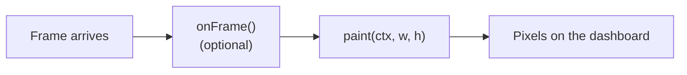

# Painter widget

The Painter is a Pro dashboard widget that gives you a blank canvas and a `paint(ctx, w, h)` callback. If the built-in widgets don't draw what you have in mind — a phosphor-style oscilloscope, a polar plot, a one-off mimic of a piece of lab equipment — write twenty lines of JavaScript and you're done. Every other dashboard widget is a fixed visualization with a few configuration knobs. The Painter is the escape hatch.

It's a Pro feature.

## What it is, in one breath



Each Painter widget is bound to one group. On every dashboard tick:

1. Serial Studio updates the group's datasets with the latest parsed values.
2. If your script defines `onFrame()`, it runs once. This is where you advance state — push a sample into a ring buffer, decay a peak hold, integrate an angle.
3. `paint(ctx, w, h)` runs. `ctx` is a Canvas2D-shaped context, `w`/`h` are the widget's pixel size. Whatever you draw lands on the dashboard.

There's no scene graph, no retained-mode anything, no QML. You get a `QPainter` wrapped in a `CanvasRenderingContext2D` API and you draw. Frames are repainted at the dashboard refresh rate (24 Hz by default) regardless of how fast data arrives.

## The script

A Painter script defines two functions: `paint()` (required) and `onFrame()` (optional).

```javascript
// Minimal example: a single bar that follows datasets[0].
function paint(ctx, w, h) {
  ctx.fillStyle = "#f5f5f1";
  ctx.fillRect(0, 0, w, h);

  if (datasets.length === 0) return;

  const ds = datasets[0];
  const v  = (ds.value - ds.min) / (ds.max - ds.min || 1);

  ctx.fillStyle = "#10b981";
  ctx.fillRect(8, h - v * (h - 16) - 8, w - 16, v * (h - 16));
}
```

That's the whole widget. No `onFrame()`, no state, just read the current value each tick and paint it.

### `paint(ctx, w, h)`

Called every UI tick. Always runs. The current path is cleared at the top of each call (you start with an empty path) and the bitmap is wiped to transparent, but `fillStyle`, `strokeStyle`, `font`, the transform, and the rest of the context state persist from the previous frame. If you've ever set `globalAlpha = 0.5` halfway through a `paint()` and forgotten to restore it, every subsequent frame still has 50 % alpha. Either set the values you need at the top of every call, or wrap modifications in `save()` / `restore()`.

The function should return quickly. Aim for under 10 ms. Above 30 ms, two ticks in a row, Serial Studio surfaces a soft warning in the widget's status — paint isn't blocked, but you're behind the refresh rate. A 250 ms watchdog interrupts the script if it ever locks up, so an infinite loop won't freeze the dashboard.

### `onFrame()`

Called once per dashboard tick, before `paint()`. Optional. Both functions run on every tick regardless of whether the widget is currently visible, so a Painter on a hidden workspace tab still maintains its state — switch back to the tab and history buffers, peak holds, and integrators are caught up.

The reason `onFrame()` exists as a separate hook is separation of concerns: `onFrame()` for the time-domain stuff (push a sample, decay a peak, increment a counter), `paint()` for the rendering. Keeping them apart makes the script much easier to read once it grows past a single function.

```javascript
const HISTORY = 256;
const trace   = [];

function onFrame() {
  if (datasets.length === 0) return;
  trace.push(datasets[0].value);
  if (trace.length > HISTORY) trace.shift();
}

function paint(ctx, w, h) {
  ctx.fillStyle = "#06140a";
  ctx.fillRect(0, 0, w, h);

  if (trace.length < 2) return;

  ctx.strokeStyle = "#22c55e";
  ctx.lineWidth   = 2;
  ctx.beginPath();
  for (let i = 0; i < trace.length; ++i) {
    const x = (i / (HISTORY - 1)) * w;
    const y = h - (trace[i] / 100) * h;
    i === 0 ? ctx.moveTo(x, y) : ctx.lineTo(x, y);
  }
  ctx.stroke();
}
```

### Persistent state

Variables declared at the top of the file (`const`, `let`, `var`) live for as long as the widget exists. They keep their values between calls. That's how the example above accumulates a 256-sample history across hundreds of frames without re-allocating each tick.

State is reset when the script is recompiled (Apply in the editor) or when the widget is destroyed (project closed, group deleted). Disconnecting the device does **not** reset state — your peak-hold values, your trace buffers, your phase accumulators all survive a reconnect.

## What's in scope

Three globals are always available inside `paint()` and `onFrame()`.

### `datasets`

An array-like view of the group's datasets. `datasets.length` is the count, `datasets[i]` is the i-th dataset. Each dataset is a frozen object with the fields below — they're getters, so they always return the current value, no need to refresh anything.

| Field        | Type    | Description |
|--------------|---------|-------------|
| `index`      | number  | Frame index (column position). |
| `uniqueId`   | number  | Stable unique ID across project edits. |
| `title`      | string  | Display name. |
| `units`      | string  | Measurement units (`"degC"`, `"rpm"`, ...). |
| `widget`     | string  | Dataset widget type, if any (`"bar"`, `"gauge"`, `"compass"`). |
| `value`      | number  | Post-transform numeric value. `NaN` if the dataset is invalid. |
| `rawValue`   | number  | Pre-transform numeric value. |
| `text`       | string  | Post-transform string value. |
| `rawText`    | string  | Pre-transform string value. |
| `min`, `max` | number  | "Best" range — falls back through widget bounds → plot bounds → FFT bounds. |
| `widgetMin`, `widgetMax` | number | Widget-specific bounds (`wgtMin`/`wgtMax`). |
| `plotMin`, `plotMax`     | number | Plot bounds. |
| `fftMin`, `fftMax`       | number | FFT bounds. |
| `alarmLow`, `alarmHigh`  | number | Alarm thresholds. |
| `ledHigh`                | number | LED activation threshold. |
| `hasPlot`, `hasFft`, `hasLed` | boolean | Visualization flags from the project. |

`datasets` itself is a Proxy: out-of-range indices return `undefined`, and you can't add or remove entries.

### `group`

Metadata about the group this Painter is bound to.

| Field      | Type    | Description |
|------------|---------|-------------|
| `id`       | number  | Group ID. |
| `title`    | string  | Group title. |
| `columns`  | number  | Configured column count for the group. |
| `sourceId` | number  | Source feeding this group (for multi-source projects). |

### `frame`

Metadata about the current dashboard tick.

| Field          | Type    | Description |
|----------------|---------|-------------|
| `number`       | number  | Monotonic frame counter, starting from 1. |
| `timestampMs`  | number  | Wall-clock timestamp in milliseconds since epoch. |

`frame.timestampMs` is the right thing for animations and timers — it's monotonic at the millisecond level and doesn't care about garbage collection pauses or repaint hiccups.

### `console`

`console.log`, `console.info`, `console.debug`, `console.warn`, `console.error` route to the Painter widget's console output (visible in the editor while you're authoring). Same calling convention as a browser console. Useful for one-off debugging; expensive when called every tick, so strip it out before you ship.

## The drawing API

The context object passed to `paint()` is intentionally Canvas2D-shaped. If you've drawn on an HTML `<canvas>`, you already know the API. The list below is what's actually wired to QPainter — anything not on it isn't supported.

### State

| Property       | Notes |
|----------------|-------|
| `fillStyle`    | CSS-style color string (`"#22c55e"`, `"rgba(255,0,0,0.5)"`, named colors). |
| `strokeStyle`  | Same as fillStyle. |
| `lineWidth`    | Pixels. |
| `lineCap`      | `"butt"`, `"round"`, `"square"`. |
| `lineJoin`     | `"miter"`, `"round"`, `"bevel"`. |
| `font`         | CSS-style font shorthand (`"bold 14px monospace"`, `"12px sans-serif"`). |
| `textAlign`    | `"left"`/`"start"`, `"center"`, `"right"`/`"end"`. |
| `textBaseline` | `"alphabetic"`, `"top"`, `"middle"`, `"bottom"`, `"hanging"`. |
| `globalAlpha`  | 0.0 to 1.0. |

`save()` / `restore()` push and pop the full state stack including the transform.

**No gradient or pattern objects.** Canvas2D's `createLinearGradient` / `createRadialGradient` / `createPattern` are not implemented. `fillStyle` and `strokeStyle` only accept color strings. To approximate a gradient, draw a stack of solid-color rectangles or arcs in adjacent slices — every shipped template that "looks gradient" (the audio meter, the dial gauge, the progress rings) is doing exactly that.

### Transforms

`translate(x, y)`, `rotate(radians)`, `scale(sx, sy)`, `resetTransform()`. Rotations are in **radians**, like Canvas2D — wrap with `* Math.PI / 180` if your data is in degrees.

### Paths

`beginPath()`, `closePath()`, `moveTo(x, y)`, `lineTo(x, y)`, `rect(x, y, w, h)`, `arc(x, y, r, startRad, endRad, counterClockwise=false)`, `quadraticCurveTo(cpx, cpy, x, y)`, `bezierCurveTo(c1x, c1y, c2x, c2y, x, y)`. Then `fill()`, `stroke()`, or `clip()` to commit.

**Always `moveTo()` to the arc's start point before calling `arc()`.** `PainterContext::arc` maps to `QPainterPath::arcTo`, which connects the path's current cursor (the implicit origin (0, 0) immediately after `beginPath()`) to the arc's start with a straight line. If you skip the `moveTo`, the chord becomes part of the path: a stroke draws a stray streak across the widget; a fill encloses the chord; a clip cuts a wedge out of your clipping region. The fix is one line:

```javascript
ctx.beginPath();
ctx.moveTo(cx + Math.cos(startA) * r, cy + Math.sin(startA) * r);
ctx.arc(cx, cy, r, startA, endA);
ctx.stroke();
```

For full circles (`0` to `Math.PI * 2`), the simplest cursor is `moveTo(cx + r, cy)`. Every shipped template follows this convention.

### Direct shapes

`fillRect(x, y, w, h)`, `strokeRect(x, y, w, h)`, `clearRect(x, y, w, h)`. These bypass the path machinery — useful for backgrounds and grids.

### Text

`fillText(text, x, y)`, `strokeText(text, x, y)`, `measureTextWidth(text)`. Honors `font`, `textAlign`, and `textBaseline`.

### Images

`drawImage(src, x, y)` and `drawImageScaled(src, x, y, w, h)`. The `src` string is resolved through a small sandbox: `qrc:/` resources, the project file's directory, and the user's Documents folder are allowed. Anything else (`/etc/passwd`, `C:/Windows/...`) is rejected, so a malicious project file can't read arbitrary files off the host.

```javascript
ctx.drawImage("logo.png", 12, 12);                        // resolved relative to the project
ctx.drawImage("qrc:/icons/dashboard-large/painter.svg",   // bundled resource
              0, 0);
```

## Adding a Painter widget to a project

1. Open the **Project Editor** (toolbar wrench, or `Ctrl+Shift+P` / `Cmd+Shift+P`).
2. Click **Add Painter** in the toolbar. A new Painter group is created with a default template attached.
3. Add datasets to the group the same way you would for a Data Grid or MultiPlot. The script will see them through the `datasets` global.
4. Select the group in the tree and click **Edit Code** to open the script editor.
5. Pick a built-in template from the dropdown to start from something concrete, or write from scratch. Click **Apply** to compile and reload.

The template dropdown is the fastest way to get a feel for the API. Every template is a small, self-contained script — read three of them and you'll know everything in this document.

## Built-in templates

Eighteen ready-to-use scripts ship with Serial Studio. Most use the light-theme card aesthetic described in [Composition and visual style](#composition-and-visual-style); the instrument-style templates (oscilloscope, radar sweep, artificial horizon) keep the back-lit look that's expected of those visualizations. Pick the one closest to what you want and modify it.

| Template                | Datasets needed | What it draws |
|-------------------------|-----------------|---------------|
| Default template        | 3 (X, Y, Z)     | Position indicator with a planar dot and a Z bar. |
| Audio VU meter          | 2               | Dual VU bars with peak markers. |
| Bars with peak hold     | 1+              | Vertical bars with decaying peak-hold lines. |
| Clock face              | 1 (seconds)     | Analog clock driven by the dataset value. |
| Dial gauge              | 1               | Single arc gauge with a needle. |
| Heatmap                 | N               | Color-mapped grid, one cell per dataset. |
| Artificial horizon      | 2 (pitch, roll) | Aviation attitude indicator. |
| LED matrix              | N               | Discrete LED grid driven by per-row values. |
| Oscilloscope            | 1+              | Phosphor-style traces with a CRT background. |
| Polar plot              | 2N (angle, mag) | Multi-trace polar coordinate plot. |
| Progress rings          | 1+              | Concentric ring gauges. |
| Radar sweep             | 2N (az, range)  | Sweeping radar PPI with target blips. |
| 7-segment display       | 1+              | Retro segmented numeric readout. |
| Sparkline grid          | N               | One mini line chart per dataset. |
| Status grid             | 1+              | Tile grid with values and color-coded states. |
| Strip chart             | 1+              | Multi-trace rolling line chart. |
| Vector field            | 2N (Vx, Vy)     | Vector arrows on a grid. |
| XY scope (Lissajous)    | 2 per pair      | XY mode oscilloscope. |

Templates live under `app/rcc/scripts/painter/`. They're plain `.js` files — copy one out of the resource bundle, edit it, paste it back into the editor.

## Composition and visual style

The bundled templates share a deliberate visual language so that several Painter widgets on the same dashboard look like they came from the same designer. None of this is enforced by the engine — you can render anything you want — but if you want a polished result that screenshots well, the patterns below are worth borrowing.

### Background, vignette, card

A two-tone background reads as "finished" instead of "draft":

```javascript
ctx.fillStyle = "#f5f5f1";        // cream paper
ctx.fillRect(0, 0, w, h);
ctx.strokeStyle = "#e7e5de";      // subtle vignette frame
ctx.lineWidth = 2;
ctx.strokeRect(1, 1, w - 2, h - 2);
```

Inside that, a white "card" with a 1 px border and a faint drop shadow gives the content something to sit on:

```javascript
const pad = 14;
ctx.fillStyle = "#e2e8f0";        // shadow
ctx.fillRect(pad + 1, pad + 2, w - pad * 2, h - pad * 2);
ctx.fillStyle = "#ffffff";        // card body
ctx.fillRect(pad, pad, w - pad * 2, h - pad * 2);
ctx.strokeStyle = "#d4d4d8";
ctx.lineWidth = 1;
ctx.strokeRect(pad + 0.5, pad + 0.5, w - pad * 2 - 1, h - pad * 2 - 1);
```

The 0.5 pixel offset on `strokeRect` is the difference between a crisp 1 px border and a fuzzy 2 px ghost — see "Lines look fuzzy" under Common mistakes.

### Header strip

Every card-based template carries a header: a small all-caps title in slate (`#0f172a`), an optional secondary label in muted gray (`#64748b`) on the opposite side, and a 1 px rule (`#e5e7eb`) underneath:

```javascript
ctx.fillStyle = "#0f172a";
ctx.font = "bold 11px sans-serif";
ctx.textAlign = "start";
ctx.fillText("STEREO  VU", pad + 16, headerY + 4);

ctx.fillStyle = "#64748b";
ctx.font = "9px sans-serif";
ctx.textAlign = "end";
ctx.fillText("dB FS", w - pad - 16, headerY + 4);

ctx.fillStyle = "#e5e7eb";
ctx.fillRect(pad + 12, headerY + 12, w - (pad + 12) * 2, 1);
```

The double space in `"STEREO  VU"` is intentional: a poor-man's letter-spacing for an upper-case header without bringing in a custom font.

### Segmented bars instead of gradients

The engine has no `createLinearGradient`, but a stack of solid-colored segments looks like an LED meter and reads better in screenshots than a continuous gradient anyway. The trick is to draw every segment in two states — saturated when "lit", pastel when not — so the meter's full range is visible even at silence:

```javascript
const SEGMENTS = 32;
const SEG_GAP  = 2;
const segW = (w - SEG_GAP * (SEGMENTS - 1)) / SEGMENTS;
for (let i = 0; i < SEGMENTS; ++i) {
  const t   = (i + 0.5) / SEGMENTS;
  const lit = t <= level;
  ctx.fillStyle = lit ? lit_color(t) : unlit_color(t);
  ctx.fillRect(x + i * (segW + SEG_GAP), y, segW, h);
}
```

The same trick (`zone(v0, v1, color)` in the dial gauge, `unlit/lit` arrays in the bars-with-peak-hold) gives you discrete tri-zone coloring (green / amber / red) in two lines instead of building a gradient.

### Peak hold marker

A 2 px dark line with a 1 px halo on each side reads as a "peak indicator" without needing a glow shader:

```javascript
const px = x + w * peak;
ctx.fillStyle = "#cbd5e1";        // halo
ctx.fillRect(px - 2, y - 2, 1, h + 4);
ctx.fillRect(px + 2, y - 2, 1, h + 4);
ctx.fillStyle = "#0f172a";        // core
ctx.fillRect(px - 1, y - 3, 2, h + 6);
```

### Typography hierarchy

Three fonts cover almost every layout:

| Role            | Font spec                       | Color      |
|-----------------|---------------------------------|------------|
| Card header     | `"bold 11px sans-serif"`        | `#0f172a`  |
| Body label      | `"10px sans-serif"`             | `#64748b`  |
| Numeric value   | `"bold 18px sans-serif"`        | `#0f172a`  |

For numeric value + units side-by-side, measure the value's width with the value's own font, then advance the cursor:

```javascript
ctx.font = "bold 18px sans-serif";
const valueW = ctx.measureTextWidth(value);
ctx.fillText(value, x, y);

ctx.fillStyle = "#64748b";
ctx.font      = "10px sans-serif";
ctx.fillText(units, x + valueW + 6, y);
```

Centering text — never measure first, just set the alignment:

```javascript
ctx.textAlign = "center";
ctx.fillText(label, cx, y);
```

### Light vs dark themes

The bundled templates ship in a light theme (cream paper background, slate text, saturated accent colors) because:

- Screenshots and printed reports look professional out of the box.
- A light Painter sitting next to a dark Plot or Plot3D widget reads as a deliberate design choice.
- High-contrast accent colors (emerald / amber / crimson) pop against cream in a way they don't pop against navy.

A few templates intentionally stay dark — `oscilloscope`, `radar_sweep`, `horizon` — because the visual reference is a back-lit instrument, and dark is what makes them recognizable. If you're starting from scratch, default to light unless you have a specific instrument-panel reason not to.

### Sizing and centering

Compute available area, fit your content into the smaller dimension, then center horizontally. This is the difference between a widget that renders cleanly at any aspect ratio and one that overflows when the user resizes a workspace tab:

```javascript
const labelH = 36;                          // reserve for bottom labels
const margin = 12;
const availW = w - margin * 2;
const availH = h - margin * 2 - labelH;
const r      = Math.max(8, Math.min(availW, availH) * 0.5 - 8);
const cx     = w / 2;
const cy     = margin + r + 8;
```

Avoid hard-coding heights like `cy = h * 0.55` — they look right at one aspect ratio and break at every other.

## Examples

### Sparkline

A 60-sample rolling trace with a filled area and a "now" dot. Showcases the basic `onFrame` + `paint` split and the light card aesthetic.

```javascript
const HISTORY = 60;
const trace   = [];

function onFrame() {
  if (datasets.length === 0) return;
  const v = datasets[0].value;
  if (Number.isFinite(v)) {
    trace.push(v);
    if (trace.length > HISTORY) trace.shift();
  }
}

function paint(ctx, w, h) {
  // Cream paper background + vignette.
  ctx.fillStyle = "#f5f5f1";
  ctx.fillRect(0, 0, w, h);
  ctx.strokeStyle = "#e7e5de";
  ctx.lineWidth = 2;
  ctx.strokeRect(1, 1, w - 2, h - 2);

  if (trace.length < 2) return;

  const ds   = datasets[0];
  const span = (ds.max - ds.min) || 1;

  // Filled area under the line (light blue).
  ctx.fillStyle = "#dbeafe";
  ctx.beginPath();
  ctx.moveTo(0, h);
  for (let i = 0; i < trace.length; ++i) {
    const x = (i / (HISTORY - 1)) * w;
    const n = (trace[i] - ds.min) / span;
    const y = h - Math.max(0, Math.min(1, n)) * h;
    ctx.lineTo(x, y);
  }
  ctx.lineTo(((trace.length - 1) / (HISTORY - 1)) * w, h);
  ctx.closePath();
  ctx.fill();

  // Line on top.
  ctx.strokeStyle = "#2563eb";
  ctx.lineWidth   = 1.5;
  ctx.beginPath();
  for (let i = 0; i < trace.length; ++i) {
    const x = (i / (HISTORY - 1)) * w;
    const n = (trace[i] - ds.min) / span;
    const y = h - Math.max(0, Math.min(1, n)) * h;
    if (i === 0) ctx.moveTo(x, y);
    else         ctx.lineTo(x, y);
  }
  ctx.stroke();
}
```

### Tank level with alarm coloring

Reads a single dataset, fills a "tank" silhouette in segmented steps, and switches the fluid colour through green / amber / red as it crosses the alarm thresholds. Demonstrates the segmented-fill technique, the light card layout, and the centered numeric readout.

```javascript
function paint(ctx, w, h) {
  // Cream paper background.
  ctx.fillStyle = "#f5f5f1";
  ctx.fillRect(0, 0, w, h);
  ctx.strokeStyle = "#e7e5de";
  ctx.lineWidth = 2;
  ctx.strokeRect(1, 1, w - 2, h - 2);

  if (datasets.length === 0) return;

  const ds   = datasets[0];
  const v    = Number.isFinite(ds.value) ? ds.value : ds.min;
  const span = (ds.max - ds.min) || 1;
  const norm = Math.max(0, Math.min(1, (v - ds.min) / span));

  // Card.
  const pad = 16;
  ctx.fillStyle = "#ffffff";
  ctx.fillRect(pad, pad + 22, w - pad * 2, h - pad * 2 - 22);
  ctx.strokeStyle = "#d4d4d8";
  ctx.lineWidth = 1;
  ctx.strokeRect(pad + 0.5, pad + 22 + 0.5, w - pad * 2 - 1, h - pad * 2 - 23);

  // Header.
  ctx.fillStyle = "#0f172a";
  ctx.font = "bold 11px sans-serif";
  ctx.textAlign = "start";
  ctx.fillText("TANK  LEVEL", pad, 18);
  ctx.fillStyle = "#64748b";
  ctx.font = "9px sans-serif";
  ctx.textAlign = "end";
  ctx.fillText(ds.units || "", w - pad, 18);

  // Tank body.
  const tx = pad + 24;
  const ty = pad + 36;
  const tw = w - pad * 2 - 48;
  const th = h - ty - pad - 28;

  ctx.fillStyle = "#f1f5f9";
  ctx.fillRect(tx, ty, tw, th);

  // Pick a colour by alarm zone.
  let color = "#10b981";
  if (Number.isFinite(ds.alarmHigh) && v >= ds.alarmHigh) color = "#dc2626";
  else if (norm > 0.85) color = "#f59e0b";

  // Segmented fill -- 20 horizontal slices, bottom-up.
  const SLICES = 20;
  const sliceH = (th - 4) / SLICES;
  const filled = Math.round(norm * SLICES);
  for (let i = 0; i < filled; ++i) {
    ctx.fillStyle = color;
    ctx.fillRect(tx + 2, ty + th - (i + 1) * sliceH - 2, tw - 4, sliceH - 1);
  }

  // Tank frame.
  ctx.strokeStyle = "#94a3b8";
  ctx.lineWidth = 1;
  ctx.strokeRect(tx + 0.5, ty + 0.5, tw - 1, th - 1);

  // Centered numeric readout below the tank.
  ctx.fillStyle = "#0f172a";
  ctx.font = "bold 16px sans-serif";
  ctx.textAlign = "center";
  ctx.textBaseline = "alphabetic";
  ctx.fillText(v.toFixed(1) + " " + (ds.units || ""), w / 2, h - 10);

  ctx.textAlign = "start";
}
```

### Polar bug indicator

Two datasets — bearing (degrees) and range (0–1) — plotted as a "bug" on a polar grid. Notice the `moveTo` before every `arc()` so the chord from the implicit origin doesn't show up across the dial.

```javascript
function paint(ctx, w, h) {
  ctx.fillStyle = "#f5f5f1";
  ctx.fillRect(0, 0, w, h);
  ctx.strokeStyle = "#e7e5de";
  ctx.lineWidth = 2;
  ctx.strokeRect(1, 1, w - 2, h - 2);

  if (datasets.length < 2) return;

  const cx = w / 2;
  const cy = h / 2;
  const r  = Math.min(w, h) * 0.42;

  // Concentric range rings -- each arc starts with a moveTo.
  ctx.strokeStyle = "#cbd5e1";
  ctx.lineWidth   = 1;
  for (let i = 1; i <= 4; ++i) {
    const rr = (r * i) / 4;
    ctx.beginPath();
    ctx.moveTo(cx + rr, cy);
    ctx.arc(cx, cy, rr, 0, Math.PI * 2);
    ctx.stroke();
  }

  // Bearing spokes.
  ctx.strokeStyle = "#e2e8f0";
  for (let deg = 0; deg < 360; deg += 30) {
    const a = (deg - 90) * Math.PI / 180;
    ctx.beginPath();
    ctx.moveTo(cx, cy);
    ctx.lineTo(cx + Math.cos(a) * r, cy + Math.sin(a) * r);
    ctx.stroke();
  }

  // The bug.
  const bearing = datasets[0].value;
  const range   = Math.max(0, Math.min(1, datasets[1].value));
  const a       = (bearing - 90) * Math.PI / 180;
  const x       = cx + Math.cos(a) * r * range;
  const y       = cy + Math.sin(a) * r * range;

  ctx.fillStyle = "#dc2626";
  ctx.beginPath();
  ctx.moveTo(x + 6, y);
  ctx.arc(x, y, 6, 0, Math.PI * 2);
  ctx.fill();

  // Read-out at the bottom.
  ctx.fillStyle    = "#0f172a";
  ctx.font         = "bold 12px sans-serif";
  ctx.textAlign    = "center";
  ctx.textBaseline = "alphabetic";
  ctx.fillText(bearing.toFixed(0) + "°  /  " + (range * 100).toFixed(0) + "%",
               cx, h - 10);
  ctx.textAlign = "start";
}
```

## Performance

The Painter pipeline is designed for 24 Hz repaint of moderately complex scenes — a few hundred line segments, a couple hundred filled shapes, ten or so text labels. That's well within the budget on any modern machine.

If your script is slow, the usual culprits are:

- **Allocating in the hot path.** `for (const ds of datasets)` is fine. `datasets.map(d => d.value)` allocates a new array every frame. So does `ds.title.toUpperCase()` if you call it in a tight loop. Cache once in `onFrame()` if the cost isn't trivial.
- **Calling `measureTextWidth()` per label.** It's a real metrics call into Qt. If your label set is fixed, measure once when you compile and store the widths.
- **Drawing thousands of points without batching.** A single `beginPath()` / many `lineTo()` / one `stroke()` is one QPainter call. A `beginPath()` / `lineTo()` / `stroke()` per point is thousands. Same shape, three orders of magnitude difference in cost.
- **`drawImage` from disk every frame.** The path is hashed and the image is cached, but you still pay the lookup. Pre-resolve to a `qrc:/` path or read the image once at the top of the script and reuse it.

The watchdog interrupts the script if it runs longer than 250 ms, which is forgiving — you'd have to be doing something genuinely pathological to hit it. The soft slow-paint warning kicks in at 30 ms over two consecutive ticks.

## Common mistakes

### `ReferenceError: datasets is not defined`

**Symptom:** The script compiles but throws this error from inside `paint()` or `onFrame()`.

**Fix:** You're probably running an older Serial Studio build. Update to the current release — the bridge globals are always defined when the script runs. If you're on the current release, check the editor's status bar for a `bootstrap:` error: that's the engine telling you something is wrong with its setup, not with your code.

### The widget renders once and then freezes

**Symptom:** Initial frame looks right, then nothing changes even though data is flowing.

**Fix:** You almost certainly have an exception inside `paint()` or `onFrame()` that's flipping `runtimeOk` to false. The error message shows up next to the widget. Common cases: reading `datasets[0]` when the group is empty, dividing by `(ds.max - ds.min)` when both are zero, calling `.toFixed()` on `undefined`. Guard your accesses.

### A stray diagonal line crosses my arc

**Symptom:** A circular gauge or progress ring renders the arc plus a straight line cutting from one corner of the widget to the arc's start point.

**Fix:** `arc()` does *not* implicitly start a new subpath — it appends to whatever the current path was. Right after `beginPath()` the cursor is at the implicit origin (0, 0), and the first thing `arc()` does is connect that origin to the arc's start with a `lineTo`. When you then `stroke()`, the chord gets stroked alongside the arc; when you `fill()` or `clip()`, the chord is enclosed.

Add a `moveTo()` to the arc's start point right after `beginPath()`:

```javascript
ctx.beginPath();
ctx.moveTo(cx + Math.cos(startA) * r, cy + Math.sin(startA) * r);
ctx.arc(cx, cy, r, startA, endA);
ctx.stroke();
```

For full circles, `moveTo(cx + r, cy)` does the job.

### `createLinearGradient is not a function`

**Symptom:** The script throws this on first paint.

**Fix:** Gradient and pattern objects aren't implemented in PainterContext. Stack solid-colored rectangles or arcs instead. The audio meter, dial gauge, and progress rings templates all simulate a gradient with adjacent fills — read one of them for the pattern.

### `measureText is not a function`

**Symptom:** A line like `ctx.measureText(label).width` throws.

**Fix:** The function is `measureTextWidth(text)` and it returns the number directly — no `.width` property:

```javascript
const w = ctx.measureTextWidth("hello");   // returns 38.5 or similar
```

Better still, use `ctx.textAlign = "center"` to center text without measuring at all.

### Lines look fuzzy

**Symptom:** Thin lines render with anti-aliased blur instead of crisp pixels.

**Fix:** Canvas2D pixel coordinates address the *corners* between pixels. A 1-pixel line at integer Y is half on the row above and half on the row below. Add 0.5: `ctx.moveTo(x, y + 0.5)`. Or set `ctx.lineWidth = 1` explicitly and round your coordinates.

### Colors don't match what I wrote

**Symptom:** A `"rgba(255,0,0,0.5)"` fill doesn't look half-transparent.

**Fix:** The context state (`fillStyle`, `strokeStyle`, `globalAlpha`, transform, ...) carries over between `paint()` calls. If a previous frame ended with `globalAlpha = 0.5`, the next frame starts with it. Either set every property you depend on at the top of `paint()`, or wrap mid-frame changes in matched `save()` / `restore()` pairs. Bitmap pixels are wiped between frames; context state is not.

### State leaks between channels

**Symptom:** Two datasets seem to share a buffer when they shouldn't.

**Fix:** The script has one global scope per Painter widget, not per dataset. If you write `let trace = []`, that's *one* trace shared across every dataset. Use an array indexed by dataset index instead — every template that needs per-channel state does it that way.

### `drawImage` shows nothing

**Symptom:** No error, no image, just blank space.

**Fix:** The path resolver only allows `qrc:/`, the project's directory, and `~/Documents`. If your image lives anywhere else, copy it next to your project file. The widget will surface a `drawImage:` error in `lastError` if the path is rejected — check the status bar.

## Tips

- Start from a template. The eighteen scripts that ship with Serial Studio cover most of the common shapes — picking the closest one and modifying it is faster than writing from scratch.
- Keep `paint()` pure. Move every "what changed since last frame" piece into `onFrame()`. The widget gets easier to reason about as soon as `paint()` is just a function of the current state.
- Use `frame.timestampMs` for time, not `Date.now()`. They behave the same on this scale, but `frame.timestampMs` is what the rest of the dashboard uses, so timestamps line up across widgets.
- If a Painter is doing something a built-in widget could do — a single bar, a single gauge, a basic line plot — use the built-in. The Painter is for when nothing else fits.
- The `console` output is throttled to whatever the dashboard refresh rate is, so a `console.log` per tick is at most 24 lines per second. Useful while debugging, expensive in shipped projects.
- For complex scripts, name the helpers. A 200-line `paint()` is hard to read; a `paint()` that calls `drawGrid(ctx, w, h)`, `drawTraces(ctx, w, h)`, `drawLegend(ctx, w, h)` is straightforward.

## See also

- [Widget Reference](Widget-Reference.md): the full list of built-in dashboard widgets. Reach for the Painter when none of them fit.
- [Frame Parser Scripting](JavaScript-API.md): the JavaScript engine on the *receiving* side of the pipeline. Same engine type, different role.
- [Output Controls](Output-Controls.md): user-scripted widgets that send data *to* the device. The other half of the scripting story.
- [Dataset Value Transforms](Dataset-Transforms.md): per-dataset scripts for calibration and filtering. Run before the Painter sees the value.
- [Project Editor](Project-Editor.md): adding groups, datasets, and Painter widgets to a project.
